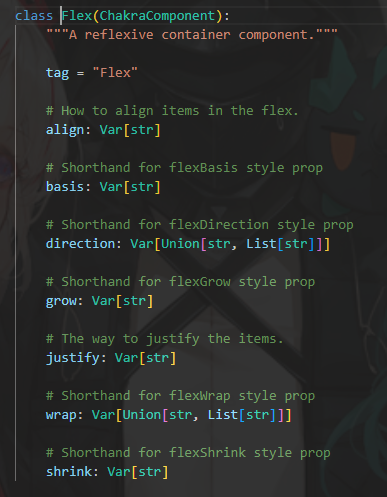
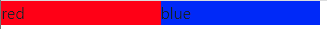
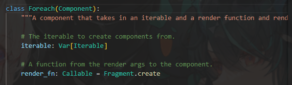
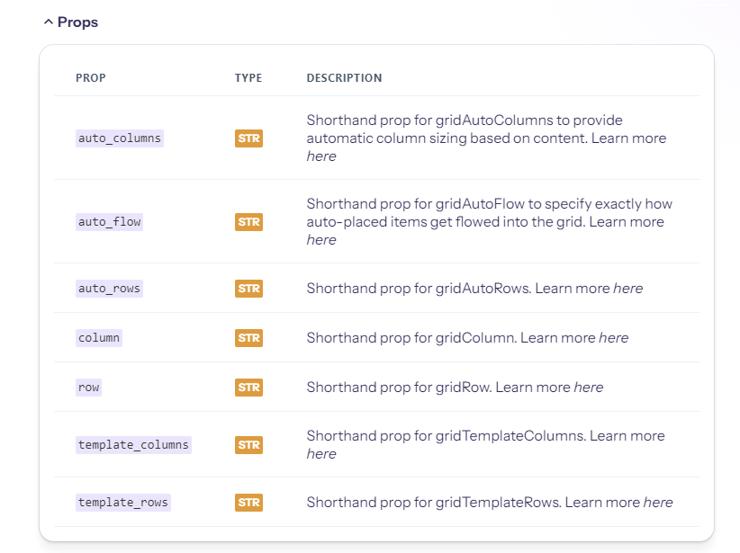
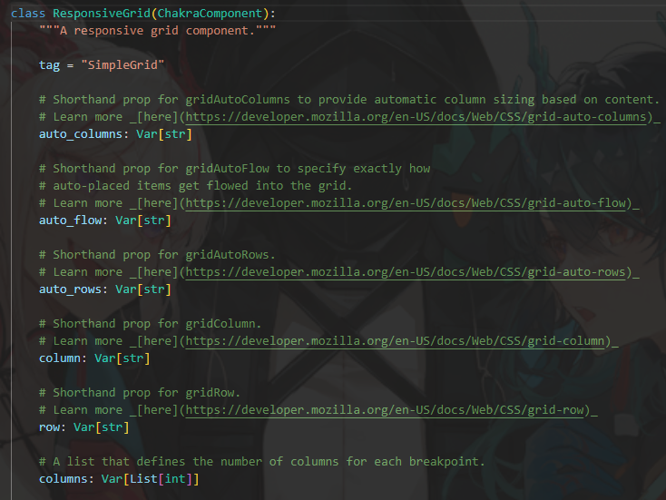

### Flex

flex也很常在css裡看到，響應式網頁設計的好工具。

```python
def index():
    return rx.flex(
    rx.center("Center", bg="lightblue"),
    rx.square("Square", bg="lightgreen", padding=10),
    rx.box("Box", bg="salmon", width="150px"),
)
```

照著css去寫就可以了。

而這裡也寫得很清楚。



### Foreach

`Foreach`這個元件使用了迭代，簡單舉個例子。
```python
from typing import List

class TestForeach(rx.State):
    color : List[str] = [
        'red',
        'blue',
    ]


def box(color: str):
    return rx.box(rx.text(color), bg = color)

def index():
    return rx.responsive_grid(
        rx.foreach(TestForeach.color, box),
        columns = [2, 4, 6]
    )

```
這個部分可能稍微比較難，況且一般也很少用到`responsive_grid`這個東西，下方是建構出來的結果。



看下圖，可知迭代。


而foreach也有個好用的東西叫做`list_item`，可以建構出屬於自己的todolist。

### Grid
上面有用到`responsive_grid`這個東西，那理所當然地也有`grid`。
編寫依舊靠css，不過有小部分不同。
```python
def index():
    return rx.grid(
    rx.grid_item(row_span=2, col_span=1, bg="lightblue"),
    rx.grid_item(col_span=2, bg="lightgreen"),
    rx.grid_item(col_span=2, bg="yellow"),
    rx.grid_item(col_span=4, bg="orange"),
    template_rows="repeat(2, 1fr)",
    template_columns="repeat(5, 1fr)",
    h="200px",
    width="100%",
    gap=4,
)
```

他的`props`如下，有些簡化了，稍微注意一下即可。


### ResponsiveGrid
同上，差不多，他的`props`也有做修改。
```python
def index():
    return rx.responsive_grid(
    rx.box(height="5em", width="5em", bg="lightgreen"),
    rx.box(height="5em", width="5em", bg="lightblue"),
    rx.box(height="5em", width="5em", bg="purple"),
    rx.box(height="5em", width="5em", bg="tomato"),
    rx.box(height="5em", width="5em", bg="orange"),
    rx.box(height="5em", width="5em", bg="yellow"),
    columns=[1, 2, 3, 4, 5, 6],
)
```

這個地方就自己運行一下吧，也可以做更動。

不過可以看看`responsive_grid`裡面有甚麼。



這裡沒有截圖完整，不過寫之前可以看看這裡，畢竟和css有些小小的出入。