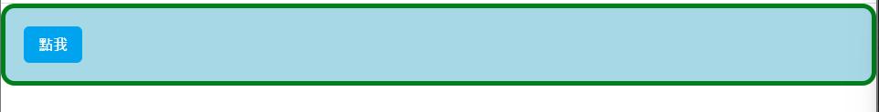
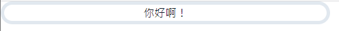
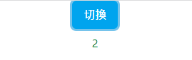
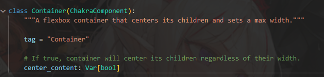

### box

最簡單的box就是搭配著`css`運行，簡單舉個例子。
```python
def index():
    return rx.box(
        rx.button(
            '點我',
            color_scheme='twitter',
        ),
        bg = 'lightblue',
        border_radius = '15px',
        border_color="green",
        border_width="thick",
        padding=5,
    )
```

範例圖如下。


還有個嵌入可以使用。
```python
def index():
    return rx.box(
        # The type element to render. You can specify an image, video, or any other HTML element such as iframe.
        element = 'iframe',
        src = "https://www.youtube.com/embed/7QskmAsU9kc",
        width = '894px',
        height = '503px'
    )
```

結果圖如下。


### Center

這裡就是`css`的主場了。
```python
def index():
    return rx.center(
        rx.text('你好啊！'),
        border_radius = '20px',
        border_width="thick",
        width="50%",
    )
```
結果如下


同時也有`Circle`和`Square`可以試試。

### cond

條件，對比過來就是`if/else`，`cond`這個元件接受一個條件與兩個元件，如果條件為真，渲染第一個元件，否則渲染第二個。

```python
class CondButton(rx.State):
    switch: bool = True

    def change(self):
        self.switch = not (self.switch)


def index():
    return rx.vstack(
        rx.button(
            '切換',
            color_scheme = 'twitter',
            on_click =  CondButton.change,
        ),
        rx.cond(
            CondButton.switch,
            rx.text(
                "1", 
                color = 'red'
                ),
            rx.text(
                "2",
                color = 'green'
            )
        )
    )

```

1和2切換，如下。



### Container
css裡常見到這貨，排版避不過，字面上是容器的意思，可以把底下的`div`啦`span`啦通通包起來，在給css命名的時候父層可以用`container`讓標籤語意化。

不過，這邊的容器...似乎看起來就是容器(？)
```python
def index():
    return rx.container(
    rx.box(
        "Example", bg="blue", color="white", width="50%"
    ),
    center_content=True,
    bg="lightblue",
)

```

我去看了tag，就這樣來說真的是個容器，不過可以調整`width`等基礎css。

