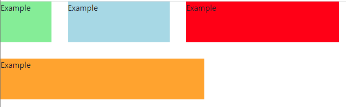
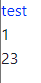

### Card

card分為幾個部分`CardHeader`、`CardBody`、`CardBody`。

```python
def index():
    return rx.card(
        rx.text("Body of the Card Component"),
        header=rx.heading("Header", size="lg"),
        footer=rx.heading("Footer", size="sm"),
    )
```

### Spacer

建立一個可以調整的空白空間，用來調整flex內子元素的差距。

```python
def index():
    return rx.card(
        rx.text("Body of the Card Component"),
        header=rx.heading("Header", size="lg"),
        footer=rx.heading("Footer", size="sm"),
    )
```

### Stack
分為`vstack`與`hstack`

```python
def index():
    return rx.vstack(
        rx.box(
            'test'
        ),
        rx.box(
            'test1'
        )
    )
```
縱向的是vstack，橫向就是把`vstack`改成`hstcak`就可以了。


### Warp

包起來，這邊也是css的flex操作。

```python
def index():
    return rx.wrap(
    rx.wrap_item(
        rx.box(
            "Example", bg="lightgreen", w="100px", h="80px"
        )
    ),
    rx.wrap_item(
        rx.box(
            "Example", bg="lightblue", w="200px", h="80px"
        )
    ),
    rx.wrap_item(
        rx.box("Example", bg="red", w="300px", h="80px")
    ),
    rx.wrap_item(
        rx.box("Example", bg="orange", w="400px", h="80px")
    ),
    width="100%",
    spacing="2em",
    align="center",
)
```
官網示意圖如下。


### AspectRatio
目前尚未推出，等之後正式發布再更新這個部分。

### Fragment

片段會定義及管理自己的版面配置，也擁有自己的生命週期，甚至還可處理各自的輸入事件，這在 `Android`裡很常遇見。

同樣的是一個元件，可以在沒有包裝器的狀況下對多個元件進行分組。

```python
def index():
    return rx.fragment(
        rx.box(
            'test',
            color = 'blue'
        ),
        rx.text(
            '1'
        ),
        rx.text(
            '23'
        )
    )
```

實際上跑出來的結果如下。
