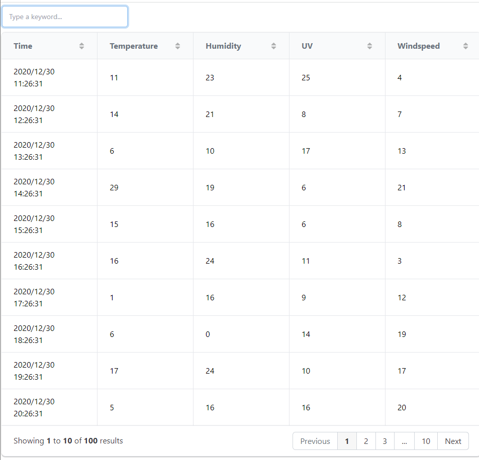
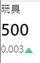
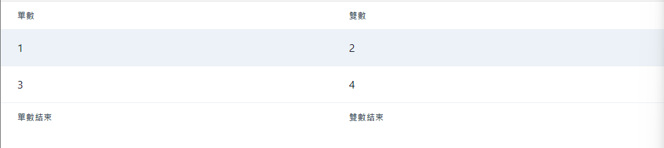
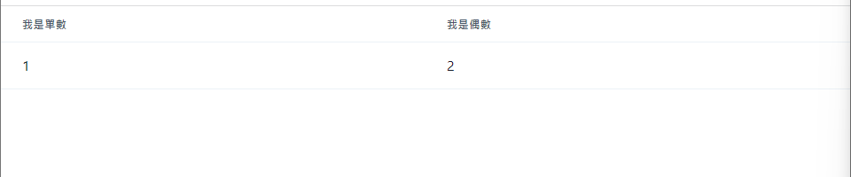

### Badge

標記，highlight，reflex裡也加了許多配料，這邊單舉一個例子就好。
```python
def index():
    return rx.hstack(
        rx.badge(
            "Example", variant="subtle", color_scheme="green"
        ),
        rx.badge(
            "Example", variant="subtle", color_scheme="red"
        ),
        rx.badge(
            "Example", variant="subtle", color_scheme="yellow"
        ),
    )
```

後面就是撰寫css的部分，就不多寫了。

### CodeBlock

撰寫程式碼的區塊，在很多網站都能看見。
```python
def index():
    return rx.code_block(
        """
        print("你好~")
        """
        language = 'python',
        show_line_numbers = True,
    )
```


### Divider
分隔線，之前就見過了。

```python
def index():
    return rx.center(
        rx.divider(
            orientation="vertical", border_color="black"
        ),
        height="4em",
    )
```

不過要稍微注意的是，你要是直線還是橫線。

### DataTable
需要引用`pandas`，接著又是熟悉的引入檔案。

```python

import pandas as pd

def index():
    sample_data = pd.read_csv(
        "https://scidm.nchc.org.tw/dataset/c18de5de-754a-4524-98d0-fea3d74183fe/resource/1bc1d160-8e63-4214-a222-414142c0bc0e/nchcproxy/env-iot-sensor_new.csv"
    )
        
    print(sample_data)

    return rx.data_table(
        data = sample_data[["Time", 'Temperature', 'Humidity', 'UV', 
                            'Windspeed']],
        pagination = True,
        search = True,
        sort = True,
    )
```

這邊他做得很好的地方是`serach`，節省了自己去寫演算法的時間...不過演算法不難，主要是看需求以及要做到哪種程度。

結果圖如下。


### List

這個部分就不贅述了，直接上碼。
```python
def index():
    return rx.list(
        rx.list_item(
            rx.icon(tag="check_circle", color="green"),
            "Allowed",
        ),
        rx.list_item(
            rx.icon(tag="not_allowed", color="red"), "Not"
        ),
        rx.list_item(
            rx.icon(tag="settings", color="grey"), "Settings"
        ),
        spacing=".25em",
    )
```

直接貼進去就可以了。

### Stat

一個乾淨整潔的視覺化好元件。

```python
def index():
    return rx.stat(
        rx.stat_label("玩具"),
        rx.stat_number("500"),
        rx.stat_help_text(
            "0.003",
            rx.stat_arrow(type_="increase")
            ),
    )
```

具體來說結果會是這樣。


還有`StatNumber`、`StatGroup`可以試用看看。

### Table
這個部分應該和`dataTable`合在一起，可不知道官網怎麼把他分開寫...沒關係，照著官網的進度走就好。

表格可以顯示資料，和`dataTable`不同的地方在於，不是拿來使用在輸出大量資料上。

先來建構簡單的表格吧。

```python
def index():
    return rx.table_container(
        rx.table(
            headers = ['單數', '雙數'],
            rows = [
                ('1', '2'),
                ('3', '4')
            ],
            footers = ['單數結束', '雙數結束'],
            variant = 'striped' 
        )
    )
```

這是加上`striped`的結果，可加可不加。


或是用最直接的辦法設置。

```python
def index():
    return rx.table(
        rx.thead(
            rx.tr(
                rx.th("我是單數"),
                rx.th("我是偶數"),
            )
        ),
        rx.tbody(
            rx.tr(
                rx.td("1"),
                rx.td("2"),
            )
        )
    )
```

最直觀就是這樣了。


不過美觀上可以再加上`color_scheme`，這個另外查一下就有了。

