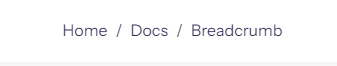
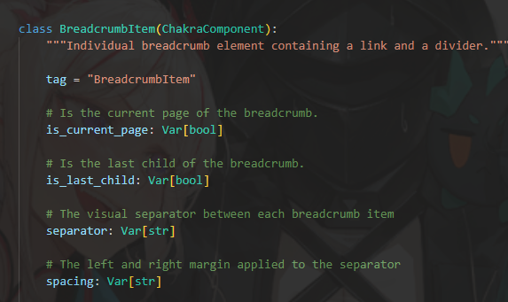

### Breadcrumb

翻譯過來是頁面路徑，這邊就直接上程式碼了。
```python
def index():
    return rx.breadcrumb(
        rx.breadcrumb_item(
            rx.breadcrumb_link("Home", href="#")
        ),
        rx.breadcrumb_item(
            rx.breadcrumb_link("Docs", href="#")
        ),
        rx.breadcrumb_item(
            rx.breadcrumb_link("Breadcrumb", href="#")
        ),
    )
```

結果圖如下。


主要我們是看以下這段


`is_current_page`是確認是否為當前頁面，`spacing`是分隔符號的左右寬距。


### Link

超連結，可以跳轉至某特定頁面。

```python
def index():
    return rx.link(
        '這是一個連結',
        href = "https://www.youtube.com/embed/KaXMMQb8gC0",
        color = 'lightblue'
    )
```

一般來說都會和 `button` 包著使用。

```python
def index():
    return rx.link(
        rx.button(
            '按我',
            color_scheme = 'twitter'
        ),
        href = "https://www.youtube.com/embed/KaXMMQb8gC0",
        color = 'lightblue',
        button = True
    )
```