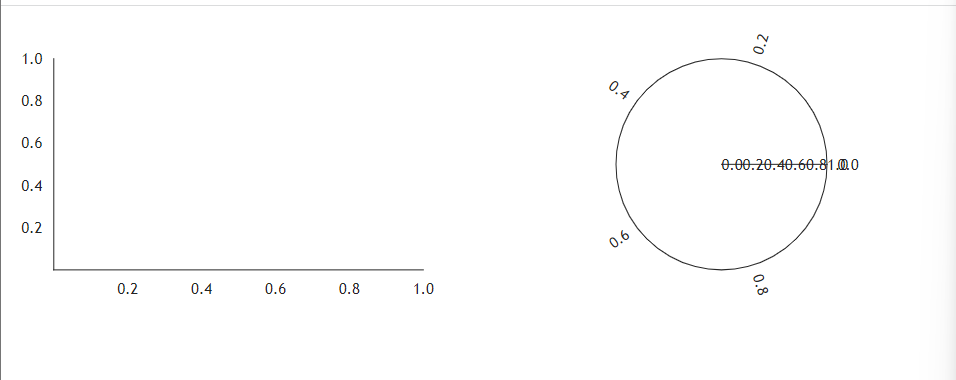
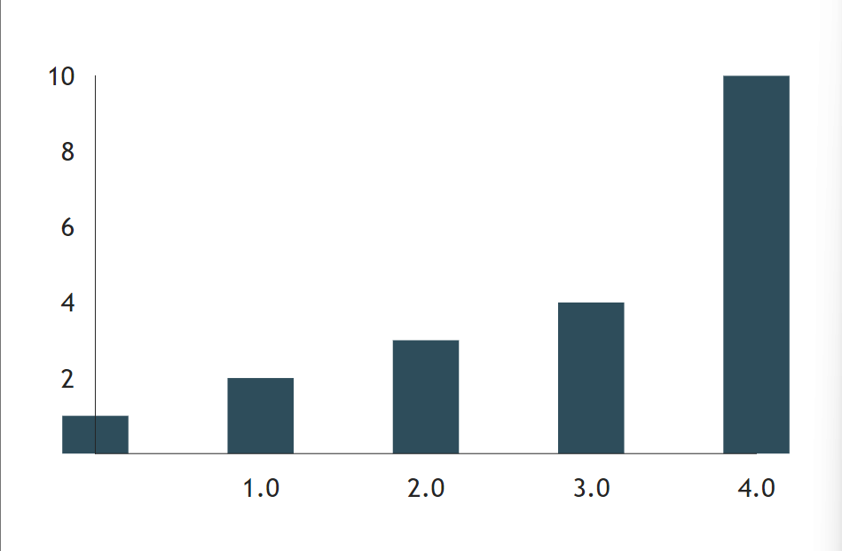
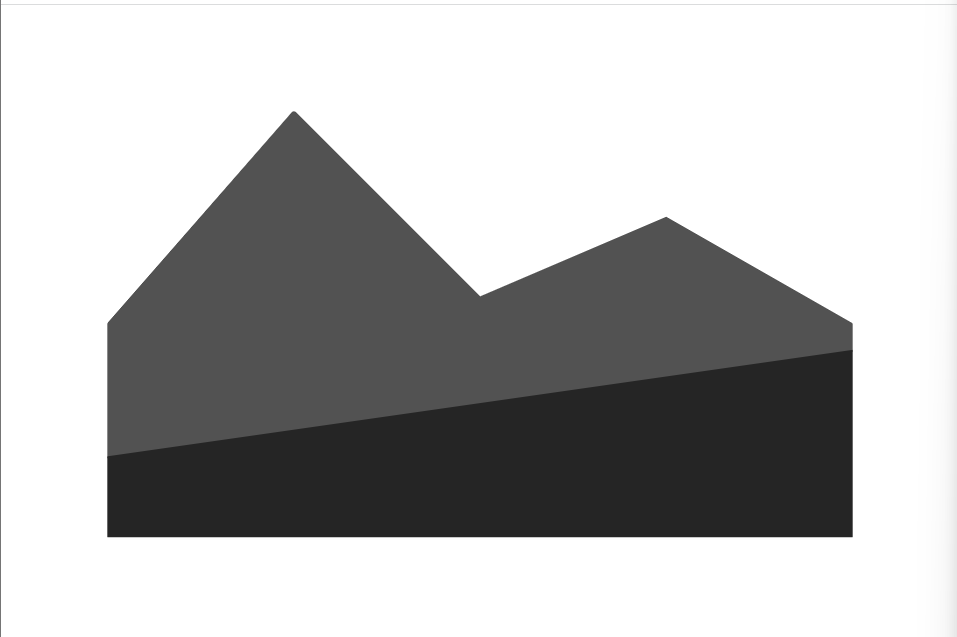
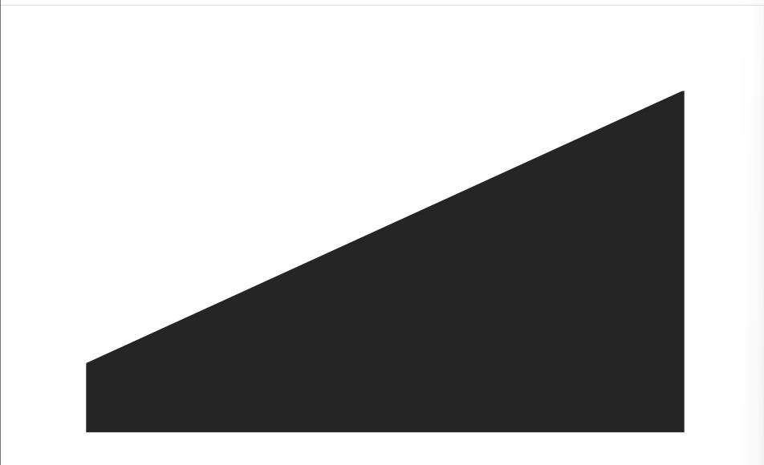
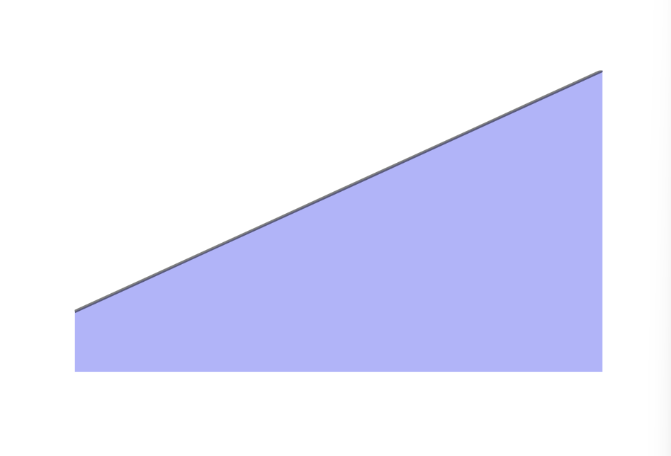

##### Chatr 與 Area
### Chart

這篇一樣快速介紹過圖表的部分，先來瞅瞅圓餅圖。

```python
def index():
    return rx.hstack(
        rx.chart(), 
        rx.chart(polar = True)
    )
```

左方是折線圖，右方是圓餅圖。


官網上也給出了一種顏色亮麗的版本。

```python
def index():
    return rx.chart(
    rx.line(
        data=rx.data(
            "line", x=[1, 2, 3, 4, 5], y=[1, 2, 3, 4, 10]
        ),
        interpolation="natural",
        style={
            "data": {"stroke": "green", "strokeWidth": 2}
        },
    ),
    rx.scatter(
        data=rx.data(
            "scatter",
            # x, y 點位
            x=[1, 2, 3, 4, 5],
            y=[5, 12, 4, 6, 1],
            # 大小
            amount=[6, 5, 3, 9, 3],
        ),
        bubble_property="amount",
        min_bubble_size=0.0,
        max_bubble_size=10.0,
        style={"data": {"fill": "#00FFFF", "opacity": 0.5}},
    ),
    domainPadding={"x": 50, "y": 50},
)
```
這邊是官網的程式碼，為了美觀我就不動了，這邊分為line和scatter的部分，主要來說沒什麼問題，`data`、`interpolation`、`style`這幾個部分稍微注意一下即可。

### ChartGroup
簡單來說就是一個包裝元件。

```python
def index():
    return rx.chart(
    rx.chart_group(
        rx.bar(
            data = rx.data(
                "bar",
                x=[0, 1, 2, 3, 4],
                y=[1, 2, 3, 4, 10],
            ),
        ),
        offset = 20.0,
        color_scale="qualitative",
    )
)
```
結果圖如下


可以在`rx.bar`後面繼續撰寫`rx.bar`，別忘了`，`就行。

### ChartStack

要注意的是`x`、`y`的長度要相同，`stack`是一個包裝元件，給定子元件後就可以呈現出來，不過和圖表不同的是，他不給予軸(x, y)或範圍的調整。

```python
def index():
    return rx.chart_stack(
        rx.area(
            data = rx.data(
                "line",
                x = [1, 2, 3, 4, 5],
                y = [3, 4, 5, 6, 7]
            ),
        ),
        rx.area(
            data = rx.data(
                "line", 
                x = [1, 2, 3, 4, 5], 
                y = [5, 12, 4, 6, 1]
            ),
        ),
    )
```

結果圖如下。



### Area

`Area`具備data屬性，是個需要用到`dict`的字典陣列，先簡單舉個例子。
```python
def index():
    return rx.area(
        data = rx.data(
            'area',
            x = [1, 3, 5, 7, 9],
            y = [2, 4, 6, 8, 10]
        )
    )
```

結果如下


現在加上`style`

```python
def index():
    return rx.area(
        data = rx.data(
            'area',
            x = [1, 3, 5, 7, 9],
            y = [2, 4, 6, 8, 10]
        ),
        style = {
            'data':{
                "fill": "rgb(107,99,246)",
                "stroke": "black",
                "strokeWidth": 2,
                "opacity": 0.5,
            }
        },
        interpolation="natural",
    )
```

結果圖如下



也可以加上`scatter`或是`line`混合使用。