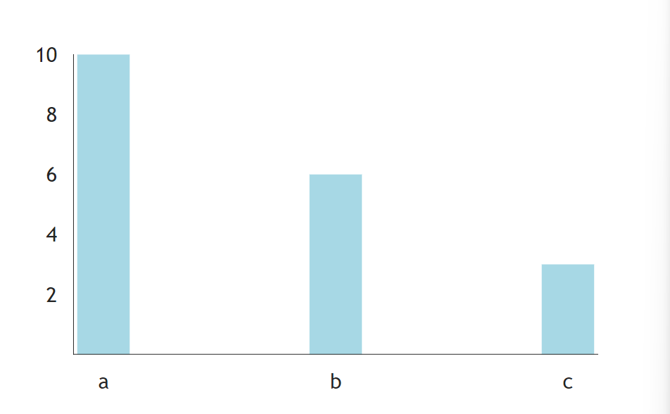
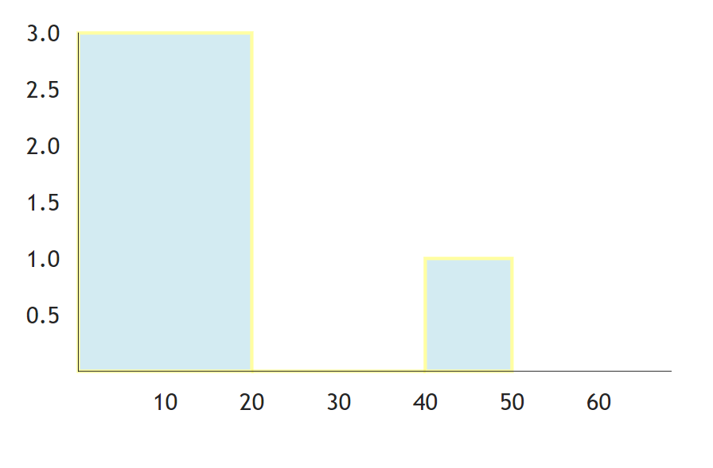

長條圖第二篇
### Bar

其實我覺得Bar可以放前面，官網把這個放在後面，有點不太懂這樣排序的意思。
沒關係，舉例吧。

```python
def index():
    return rx.chart(
        rx.bar(
            data = rx.data(
                'bar',
                x = ['a', 'b', 'c'],
                y = [10, 6, 3],
            ),
            style = {
                'data': {
                    'fill': 'lightblue',
                    'stroke': 'green',
                    'strlkeWidth': 1,
                }
            }
        ),
        domain_padding = {'x': 20, 'y': 0}
    )
```
domain_padding x的部分如果用10的話會超出邊界，還是用官網給的20好了。


### Histogram

直方圖，官網說他的x是一個list，可實際上裡面會用dict去運作。

簡單來說
```python
data = rx.data(
    data = 'histogram',
    x = [1, 2, 3]
)
```

在裡面會變成這樣。
```python
data = [
    {"x": 1},
    {"x": 2},
    {"x": 3},
]
```

所以，直接寫吧。
```python
def index():
    return rx.chart(
        rx.histogram(
            data = rx.data(
                "histogram", 
                x = [1, 9, 13, 50]
            ),
            style = {
                "data": {
                    'fill': 'lightblue',
                    'stroke': 'yellow',
                    "strokeWidth": 2,
                    "opacity": 0.5,
                },
                'lables': {
                    'fill': 'green',
                    'fontsize': 10
                }
            },
        ),
        domain_padding = {"x": 100},
    )
```
結果圖如下


主要還是要看一下 padding的大小，不然會直接融在一起...