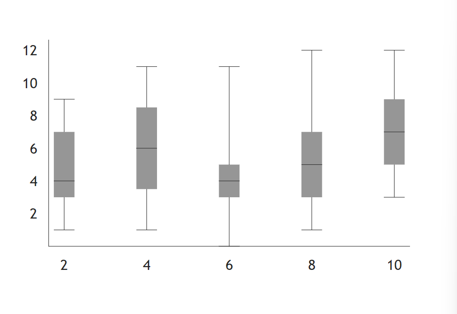
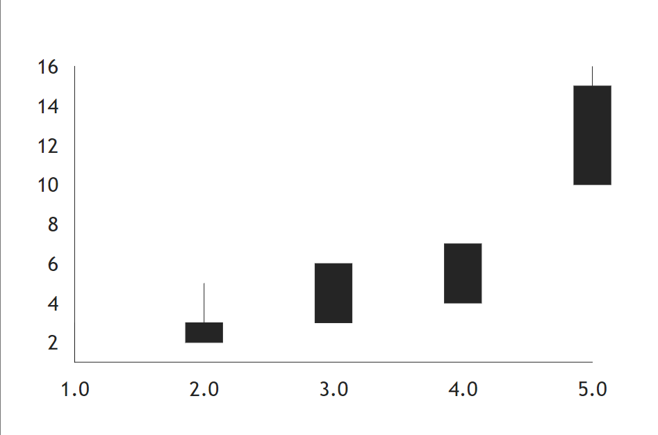
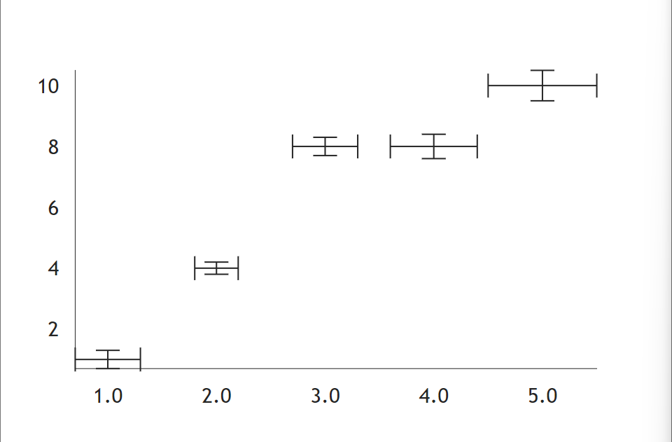
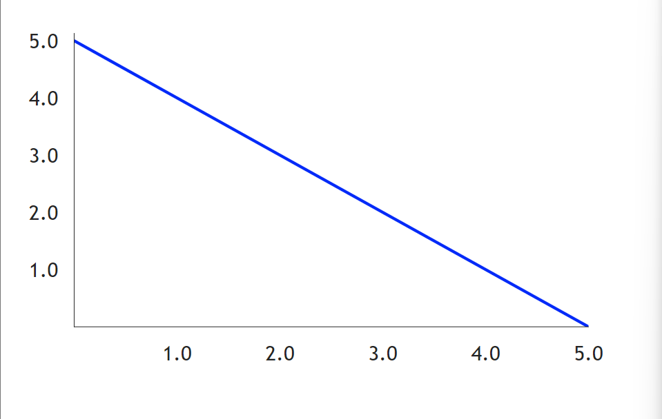

接下來是長條圖的部分，有關長條圖的都整理到這邊了。

### Boxplot

boxplot使用data這個屬性，同時帶有x, y 這兩個字典鍵結，先看個例子。
```python
def index():
    return rx.chart(
        rx.box_plot(
            data = rx.data(
                'box_plot',
                x = [2, 4, 6, 8, 10],
                y = [
                        [1, 3, 4, 7, 9], 
                        [1, 3, 5, 7, 9, 11],
                        [0, 3, 4, 5, 11],
                        [1, 12, 3, 5, 7],
                        [3, 5, 7, 9, 12]
                    ]
            )
        ),
        domain_padding = {'x' : 15, 'y': 10}
    )
```
結果圖如下。


箱型圖有`min`、`q1`、`median`、`q3`、`max`這幾個點，也可以放置進style內
```python
style = {
    'min': {'stroke': 'blue'}, 
    # ...
}
# stroke 是 css 裡代表邊框顏色。
```

### Candlestick 

繪製K線圖用的，包括開盤與收盤，最高與最低價的字典陣列。

```python
def index():
    return rx.chart(
        rx.candlestick(
            data = rx.data(
                "candlestick",
                x = [1, 2, 3, 4, 5],
                open = [1, 3, 6, 7, 15],
                close = [1, 2, 3, 4, 10],
                high = [3, 5, 6, 7, 16],
                low = [1, 2, 3, 4, 10],
            ),
        )
    )
```
自己寫出來的東西有點迷，就直接拿官網的範例吧。



### ErrorBar
誤差條是把一個誤差範圍添加到途中的條(？)，可以用在數據的基礎分布和不確定性範圍，以及差異性。

```python
def index():
    return rx.chart(
    rx.error_bar(
        data = rx.data(
            "error_bar",
            x = [1, 2, 3, 4, 5],
            y = [1, 4, 8, 8, 10],
            error_x = [0.3, 0.2, 0.3, 0.4, 0.5],
            error_y = [0.3, 0.2, 0.3, 0.4, 0.5],
        ),
    ),
)
```

範例圖如下。



### Line

一樣是有data屬性的元件。

```python
def index():
    return rx.chart(
        rx.line(
            data = rx.data(
                'line',
                x = [0, 1, 2, 3, 4, 5],
                y = [5, 4, 3, 2, 1, 0]
            ),
            interpolation = 'natural',
            style = {'data': {'stroke': 'blue'}},
        ),
        domain_padding = {'x': 0, 'y': 5}
    )
```

這樣就是一條斜直線了。


