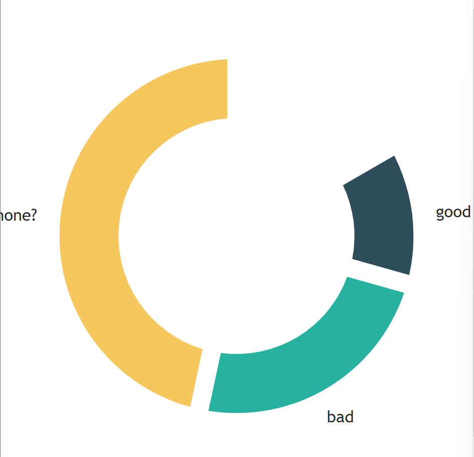
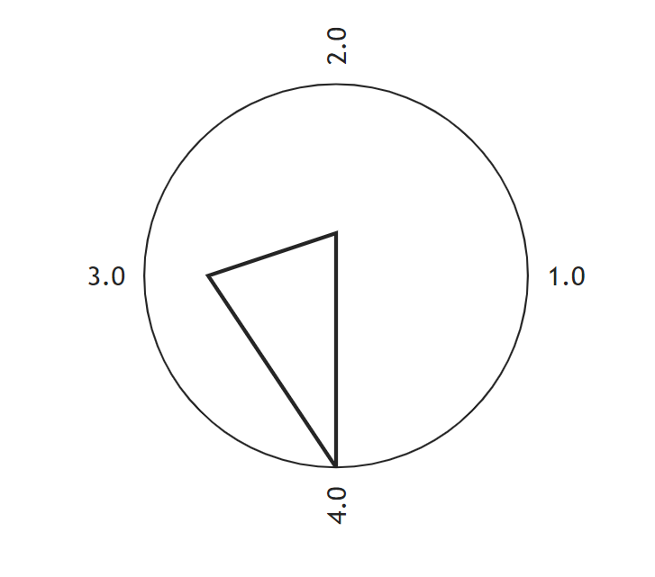
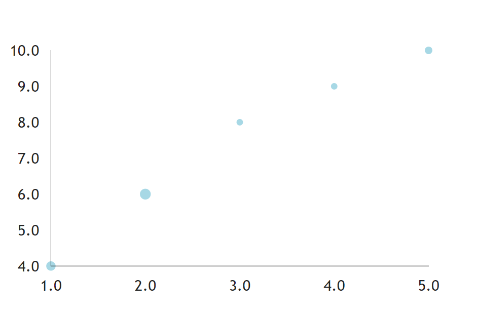
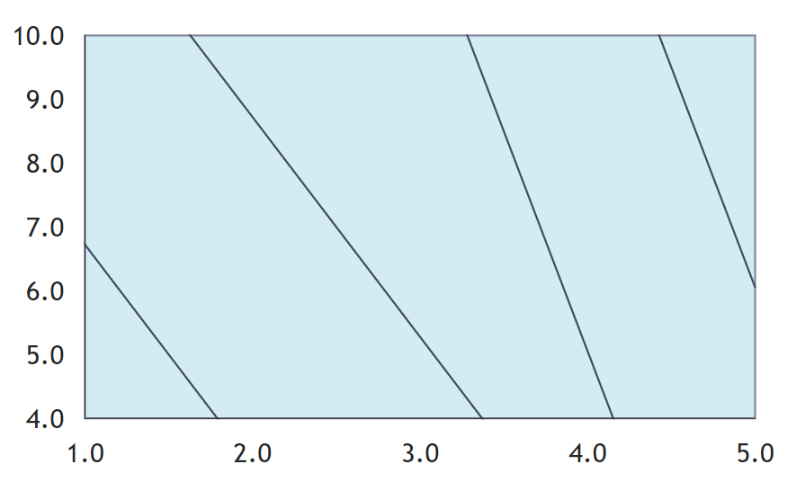
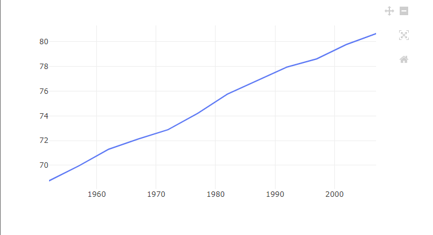

把剩下的圖一起介紹完吧。

### Pie

圓餅圖的部分和前面也都差不多，一樣是用data數組去寫入。
```python
def index():
    return rx.pie(
        data = rx.data(
            'pie',
            x = ['good', 'bad', 'none?'],
            y = [1, 2, 4],
        ),
            color_scale="qualitative",
            pad_angle = 5.0,
            inner_radius = 100.0,
            start_angle = 60.0,
    )
```

結果圖如下。


`color_scale`有一系列的色標，` "grayscale", "qualitative", "heatmap", "warm", "cool", "red", "green", "blue".`，可以套套看。

### Polar

渲染極座標的包裝元件，通常用於顯示具有不同角度和半徑的數據點。

```python
def index():
    return rx.chart(
        rx.polar(),
        rx.line(
            data = rx.data(
                'line',
                x = [1, 2, 3, 4],
                y = [1, 3, 7, 10]
            ),
        ),
        polar = True,
    )
```
感覺只有在做圖表或是數學題目很常看到這種圖...


### Scatter 

散點圖，這個大家都很熟悉了吧。
```python
def index():
    return rx.chart(
        rx.scatter(
            data = rx.data(
                'scatter',
                x = [1, 2, 3, 4, 5],
                y = [4, 6, 8, 9, 10],
                amount = [4, 5, 1, 1, 3]
            ),
            style = {
                'data': {
                    'fill': 'lightblue'
                }
            },
            # 設定氣泡圖中資料點縮放的下限。
            min_bubble_size = 3.0,
            # 設定氣泡圖中資料點縮放的上限。
            max_bubble_size = 5.0,
            bubble_property = 'amount'
        )
    )
```

結果圖如下。



### Voronoi

Voronoi圖是一種用來可視化Voronoi單元的方法，通常以多邊形的形式呈現，每個多邊形代表一個Voronoi單元，並且其邊界由與相鄰Voronoi單元的邊界相切的直線或曲線構成。[chatgpt]()

直接上例子。
```python
def index():
    return rx.chart(
        rx.voronoi(
            data = rx.data(
                'voronoi',
                x = [1, 2, 3, 4, 5],
                y = [4, 6, 8, 9, 10],
            ),
            style = {
                'data': {
                    'fill': 'lightblue',
                    'stroke': '#050A30',
                    "strokeWidth": 1,
                    "opacity": 0.5,
                }
            },
        )
    )
```

結果圖如下。


[可以看看這個](https://tedsieblog.wordpress.com/2018/11/29/voronoi-diagram-a-case-study-of-fortunes-algorithm/)

### Plotly

繪製3D圖表會用到的東西，matlib也有。
不過手頭目前沒有可以用的csv檔，我就拿官網的2D範例吧。

```python
def index():
    df = px.data.gapminder().query("country=='Canada'")
    fig = px.line(
        df,
        x = "year",
        y = "lifeExp",
        title = "Life expectancy in Canada",
    )
    return rx.plotly(data = fig, height = "400px")
```

記得你要`return`的對象，不要返回錯了。
