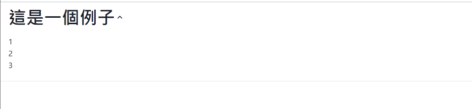
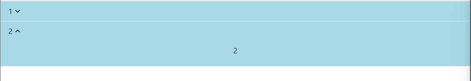
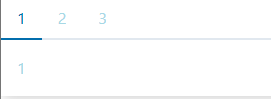

### Accordion

手風琴（Accordion）是一種常見的網頁元素，通常用於創建可展開和折疊的內容區塊，以節省空間並提供更好的用戶體驗。[chatgpt]()

這部分應該是最好理解的，直接上碼。

```python
def index():
    return rx.accordion(
        rx.accordion_item(
            rx.accordion_button(
                rx.heading('這是一個例子'),
                rx.accordion_icon(),
            ),
            rx.accordion_panel(
                rx.text('1'),
                rx.text('2'),
                rx.text('3'),
            ),
        ),
        allow_toggle = True,
        width = "100%",
    )
```
結果圖如下。



官網上也有提供背景版本，以及多層手風琴...

```python
def index():
    return rx.accordion(
        rx.accordion_item(
            rx.accordion_button(
                rx.heading('這是一個例子'),
                rx.accordion_icon(),
            ),
            rx.accordion_panel(
                rx.accordion(
                    rx.accordion_item(
                        rx.accordion_icon(),
                        rx.heading("裡面")
                    ),
                    rx.accordion_panel(
                        rx.badge(
                            '裡面 panel',
                            variant = "lightblue",
                            # color_scheme = 'twitter'
                        )
                    )
                )
            ),
        ),
        allow_toggle = True,
        width = "100%",
    )
```

最後再上一個有背景的版本。

```python
def index():
    return rx.accordion(
        items = [
            ('1', rx.center('1')),
            ('2', rx.center('2')),
        ],
        width = "100%",
        bg = 'lightblue'
    )
```

結果圖如下


不過不知道為甚麼沒辦法兩個同時點開，我再想想怎麼寫，反正真的不行就寫兩個`according`吧。

### Tabs

頁籤選單，相信大多數人都有實際寫過，不過有UI的話直接套就可以了...懶。

```python
def index():
    return rx.tabs(
        rx.tab_list(
            rx.tab("1"),
            rx.tab("2"),
            rx.tab("3"),
        ),
        rx.tab_panels(
            rx.tab_panel(rx.text("1")),
            rx.tab_panel(rx.text("2")),
            rx.tab_panel(rx.text("3")),
        ),
        color = 'lightblue',
        shadow = 'lg',
    )
```
運行圖如下


也有另一種的，簡寫。

```python
def index():
    return rx.tabs(
        items = [
            (text, rx.text('text')),
            (),
            (),
        ],
        color = 'lightblue',
        shadow = 'lg',
    )
```

兩種效果相同，不過本人還是比較喜歡寫多一些的...