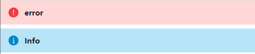
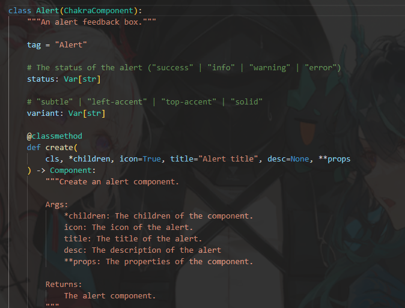
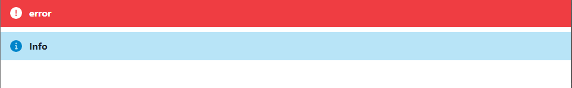
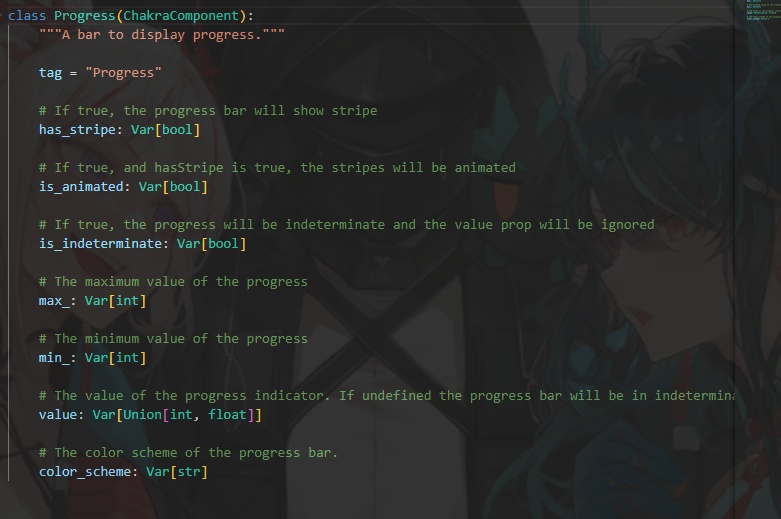

### Alert

Alert是一個十分常見的元素

```python
def index():
    return rx.vstack(
    rx.alert(
        rx.alert_icon(),
        rx.alert_title(
            "error"
        ),
        status = "error",
    ),
    rx.alert(
        rx.alert_icon(),
        rx.alert_title(
            "Info"
        ),
        status = "info",
    ),
    width = "100%",
)
```

這是運行圖



再來是原碼裡的



可以看一下status的部分，有4種可以使用。

根據上方圖示，也有`variant`可以運用。
```python
def index():
    return rx.vstack(
    rx.alert(
        rx.alert_icon(),
        rx.alert_title(
            "error"
        ),
        status = "error",
        variant="solid",
    ),
    rx.alert(
        rx.alert_icon(),
        rx.alert_title(
            "Info"
        ),
        status = "info",
        # 加在這裡。
        variant="subtle",
    ),
    width = "100%",
)
```

運行圖如下


### CircularProgress

```python
def index():
    return rx.hstack(
        rx.circular_progress(
            rx.circular_progress_label(0),
            value = 0,
        ),
        rx.circular_progress(
            value = 25,
        ),
        rx.circular_progress(
            is_indeterminate = True
        )
    )

```

運行圖如下


不出意料的還有許多屬性，`color`、`thickness`...等。


### Progress

進度條，用於顯示進度狀態。

```python
def index():
    return rx.vstack(
        rx.progress(value = 100, width = "100%"),
        rx.progress(is_indeterminate = True, width = "100%"),
        spacing = "1em",
        min_width = ["10em", "20em"],
    )
```

運行圖如下


同樣也包含許多屬性。


### Skeleton

有找到一個[輕量級的css框架](https://getskeleton.com/)，不過返回正題...
```python
def index():
    return rx.stack(
        rx.skeleton_circle(size = '50px'),
        rx.skeleton_text(
            no_of_lines = 10,
            start_color = 'lightblue.600',
            end_color = 'pink.500',
        ),
        width = '50%',
        # speed = 2.0,
    )
```

運行圖如下


具體還可以加上一個`is_loaded = True / False`。

### Spinner
用於表示事件正在處理、等待變化過程或結果。
```python
def index():
    return rx.hstack(
        rx.spinner(
            color = 'red', 
            size = 'lg',
            thickness = 3,
            speed = '2s'
        ),
        rx.spinner(
            color = 'red', 
            size = 'xl',
            thickness = 8,
            empty_color = 'lightyellow',
            speed = '0.5s'
        )
    )
```

運行圖如下
