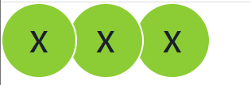
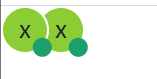
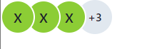
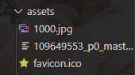

### Audio

url 可以是內部連結，也可以是外部連結。

```python
def index():
    return rx.audio(
    url="https://www.youtube.com/embed/dQw4w9WgXcQ",
    # url="https://www.learningcontainer.com/wp-content/uploads/2020/02/Kalimba.mp3",
    width="640px",
    height="auto",
    # loop = true,
    # 靜音
    # muted = True,
    # 控制本機播放器
    # controls = True,
    # 縮圖控制，點擊出現完整播放器內容。
    # light = True,
)
```

### Avatar

頭像，聊天室很常會見到的東西。
google 直接翻譯會變成阿凡達...不知道這怎麼翻的。

```python
def index():
    return rx.avatar_group(
        rx.avatar(name = 'xia', size = 'xl'),
        rx.avatar(name = 'xia', size = 'xl'),
        rx.avatar(name = 'xia', size = 'xl')
    )
```
這裡是group的展示圖


一般聊天室在線上的示意圖的話...就是在頭像下方有個綠綠的標。
```python
def index():
    return rx.avatar_group(
        rx.avatar(
            rx.avatar_badge(
                box_size = '1em',
                bg = 'green.500',
                border_color = 'green.500'
            ),
            name = 'xia'
        ),
        
        rx.avatar(
            rx.avatar_badge(
                box_size = '1em',
                bg = 'green.500',
                border_color = 'green.500'
            ),
            name = 'xia'
        )
    )
```

示意圖如下



不過官方也有提供最大數，`max`。

```python
def index():
    return rx.avatar_group(
        rx.avatar(name = 'xia'),
        rx.avatar(name = 'xia'),
        rx.avatar(name = 'xia'),
        rx.avatar(name = 'xia'),
        rx.avatar(name = 'xia'),
        rx.avatar(name = 'xia'),
        size = 'md',
        max_ = 3,
    )
```

示意圖如下。


### Icon

reflex也有提供一個lib，這裡就隨便放個例子。

```python
def index():
    return rx.icon(
        tag = "edit",
    )
```
這個地方請直接查看[官網](https://reflex.dev/docs/library/media/icon/)或是點開來看icon的內碼。

### Image

```python
def index():
    return rx.image(
        src = '/1000.jpg',
        width = '1000px',
        height = '1000px',
        # border_radius="15px 50px",
        # border="5px solid #555",
    )
```
這裡的`assets`資料夾如下


其中有個看起來很奇特的檔案，點開他。

`[ZoneTransfer]`用來指示接下來的參數屬於某個特定的區域或部分。
`ZoneId=3`這是區域的ID或識別號。
`ReferrerUrl=https://www.pixiv.net/`參考的url，這裡指向了pivix這個網站
`HostUrl=https://i.pximg.net/img-master/img/2023/07/05/21/31/54/109649553_p0_master1200.jpg`指向資源的位置


### Video

這個地方在前面有提過，就不再重複介紹了。