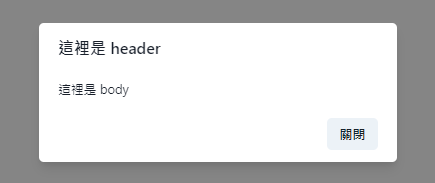
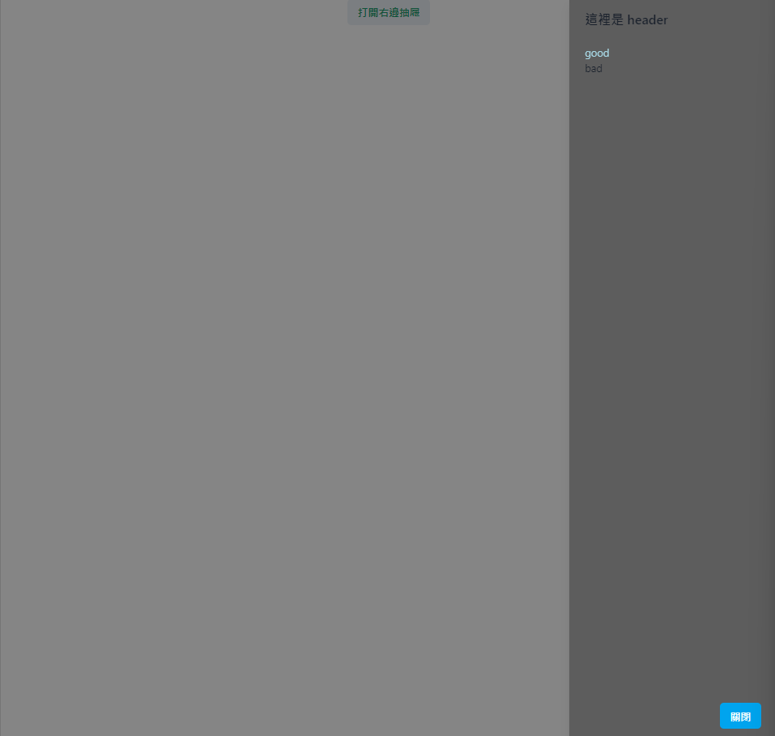

### AlertDialog 

相當於`Javascript`裡的`alert`，頁面會出現警報或是方塊元件，多用於提示。
```python
class AlertDialogState(rx.State):
    show: bool = False

    def change(self):
        self.show = not (self.show)


def index():
    return rx.box(
    rx.button(
        "出現警報",
        on_click = AlertDialogState.change,
    ),
    rx.alert_dialog(
        # 覆蓋在alert_dialog上方的元件
        rx.alert_dialog_overlay(
            # 內文
            rx.alert_dialog_content(
                rx.alert_dialog_header(
                    "這裡是 header"
                ),
                rx.alert_dialog_body(
                    "這裡是 body"
                ),
                rx.alert_dialog_footer(
                    rx.button(
                        "關閉",
                        on_click = AlertDialogState.change,
                    )
                ),
            )
        ),
        is_open = AlertDialogState.show,
    ),
)
```

這是示意圖


`show`一開始沒有要顯示，所以先寫`not`，如果需要再返回`True`，`is_open`是alert_dialog裡面的props，別忘了寫。
`preserve_scroll_bar_gap`這個props可以避免滑動的時候出現閃爍效果或是內容調整。


### Drawer
比起前面的警報，這個效果較為溫和。

```python
class DrawerState(rx.State):
    show_right: bool = False
    show_top: bool = False

    def top(self):
        self.show_top = not (self.show_top)

    def right(self):
        self.show_right = not (self.show_right)


def index():
    return rx.center(
        rx.box(
            rx.button(
                "打開右邊抽屜", 
                on_click = DrawerState.right,
                style = {
                    'color': 'green.500',
                },
            ),
            rx.drawer(
                rx.drawer_overlay(
                    rx.drawer_content(
                        rx.drawer_header("這裡是 header"),
                        rx.drawer_body(
                            rx.box(
                                'good', 
                                color = 'lightblue'
                            ),
                            rx.box(
                                'bad'
                            ),
                        ),
                        rx.drawer_footer(
                            rx.button(
                                "關閉", 
                                on_click = DrawerState.right,
                                color_scheme = 'twitter'
                            )
                        ),
                        bg = "rgba(0, 0, 0, 0.3)",
                    )
                ),
                is_open = DrawerState.show_right,
            ),
        )
    )
```

示意圖如下


[`green.500`](https://tailwind.build/classes/text-color/text-green-500)。
這裡就很靠排版了，還在css的部分打混摸魚...之後會再拉一篇寫 `style`的部分。

如果要改成 `top` 的話...(有點懶，直接摳程式碼下來了)
```python
def index():
    return rx.center(
        rx.box(
            rx.button(
                "打開右邊抽屜", 
                on_click = DrawerState.top,
                style = {
                    'color': 'green.500',
                },
            ),
            rx.drawer(
                rx.drawer_overlay(
                    rx.drawer_content(
                        rx.drawer_header("這裡是 header"),
                        rx.drawer_body(
                            rx.box(
                                'good', 
                                color = 'lightblue'
                            ),
                            rx.box(
                                'bad'
                            ),
                        ),
                        rx.drawer_footer(
                            rx.button(
                                "關閉", 
                                on_click = DrawerState.top,
                                color_scheme = 'twitter'
                            )
                        ),
                        bg = "rgba(0, 0, 0, 0.3)",
                    )
                ),
                is_open = DrawerState.show_top,
            ),
        )
    )
```

這裡有說過
```python
# in drawer.py
preserve_scroll_bar_gap: Var[bool]
# If true, a `padding-right` will be applied to the body element that's equal to the width of the scrollbar. This can help prevent some unpleasant flickering effect and content adjustment when the modal opens
```

如果為true，則顯示出scrollbar。

有點妙的是這裡沒辦法換成顯示左方的 scrollbar...可是top卻又可以，神奇。