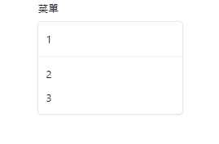
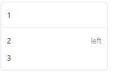
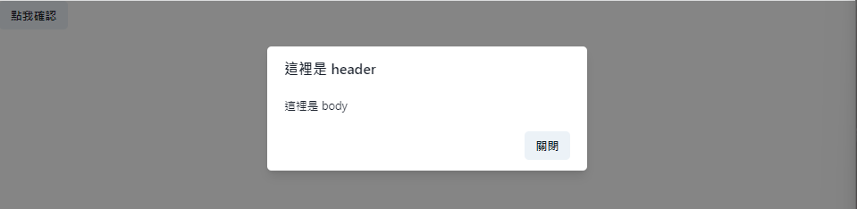
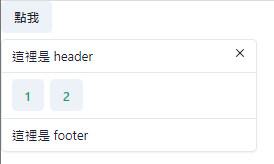
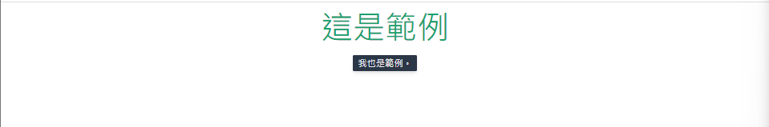

### Menu

菜單，轉換過去也就是一個list

```python
def index():
    return rx.center(
        rx.menu(
            rx.menu_button('菜單'),
            rx.menu_list(
                rx.menu_item('1'),
                rx.menu_divider(),
                rx.menu_item('2'),
                rx.menu_item('3'),
            )
        )
    ) 
```

示意圖如下


`menu_divider()`是分隔線，裡面沒辦法有新的元件，不過可以寫入`style`...也就是css的部分。

如果修改成以下樣式...
```python
rx.menu_item('2', command = 'left'),
```
示意圖。


### Modal

互動視窗，在計算機應用程序的用戶界面設計中，模式窗口是從屬於應用程序主窗口的圖形控制元素。

```python
class ModalState(rx.State):
    show: bool = False

    def change(self):
        self.show = not (self.show)


def index():
    return rx.box(
    rx.button(
        "點我確認", 
        on_click = ModalState.change
    ),
    rx.modal(
        rx.modal_overlay(
            rx.modal_content(
                rx.modal_header(
                    "這裡是 header"
                ),
                rx.modal_body(
                    "這裡是 body"
                ),
                rx.modal_footer(
                    rx.button(
                        "關閉", 
                        on_click = ModalState.change
                    )
                ),
            )
        ),
        is_open = ModalState.show,
    ),
)
```

這裡就不更改官網的範例了，示意圖如下。



其實和昨天寫的`alterdialog`、`Drawer`都差不多，就是在寫的時候注意一下props的部分即可。

### Popover

彈出視窗是一種常見的使用者介面元素，通常用於顯示短暫的訊息、選項或內容。

```python
def index():
    return rx.popover(
    rx.popover_trigger(rx.button("點我")),
    rx.popover_content(
        rx.popover_header("這裡是 header"),
        rx.popover_body(
            rx.button_group(
                rx.button('1'),
                rx.button('2'),
                style = {'color': "green.500"},
            )
        ),
        rx.popover_footer(rx.text("這裡是 footer")),
        rx.popover_close_button(),
    ),
)
```

結果圖如下。


### Tooltip
滑鼠挪過去會出現的簡單提示。

```python
def index():
    return rx.center(
        rx.tooltip(
            rx.text('這是範例', font_size = 50, color = 'green.500'),
            label = '我也是範例。',
            arrow_shadow_color = 'white',
            open_delay = 2
        )
    )
```

範例圖如下。


