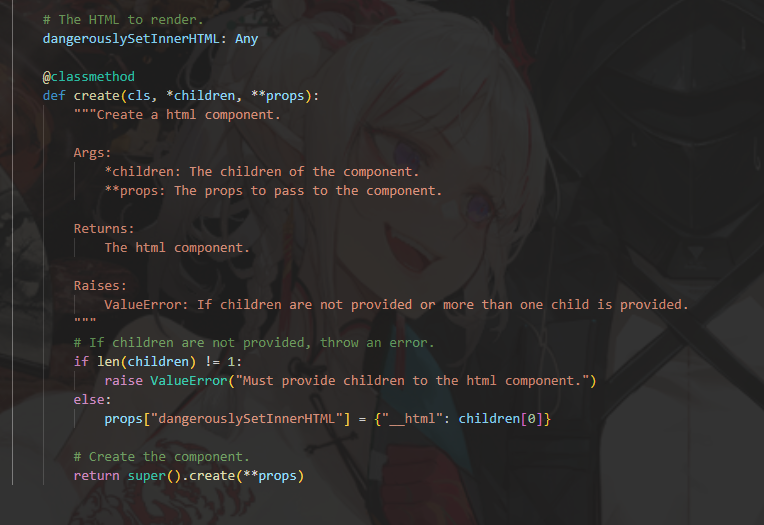
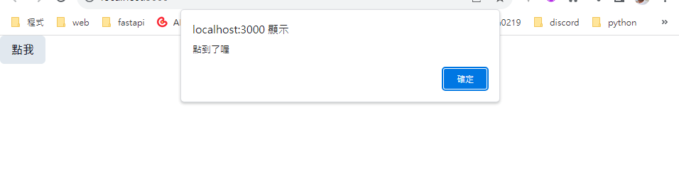

### HTML

在使用這個元件之前，可以考慮使用reflex的原始html元素支援。


```python
def index():
    return rx.vstack(
        rx.html("<h1>Hello World</h1>"),
        rx.html("<h2>Hello World</h2>"),
        rx.html("<h3>Hello World</h3>"),
        rx.html("<h4>Hello World</h4>"),
        rx.html("<h5>Hello World</h5>"),
        rx.html("<h6>Hello World</h6>"),
        rx.html(
        ""
        ),
    )
```

不過出來的文字大小似乎一樣...


根據上面這張圖，可以知道是`dangerouslySetInnerHTML`這個元素在進行渲染，還有個`element`可以放置其他內容(iframe)。


### Script

腳本元件用來當作內嵌，可以安全地與渲染一同使用。

```python
def index():
    return rx.hstack(
        rx.script(
            """
            const check_button = () => {
                window.alert("點到了喔")
            }
            """
        ),
        rx.button(
            '點我',
            on_click = rx.client_side("check_button()") 
        )
    )
```
這是範例圖


`rx.client_side`可以用來執行任意javascript程式碼來回應UI。

不過如果不想寫在同個檔案呢？

在assets資料夾內新建一個js檔案
```js
// assets/my_example.js
const check_button = () => {
    window.alert("點到了喔")
}
```

在一開始的py檔內修正如下。
```python
def index():
    return rx.hstack(
        rx.script(
            src = '/my_example.js'
        ),
        rx.button(
            '點我',
            on_click = rx.client_side("check_button()") 
        )
    )
```

script對其他任何屬性都可以透過prop提供`custom_attrs`

```python
# 取自官網
def index()
return rx.script(
    src="//gc.zgo.at/count.js",
    custom_attrs={
        "data-goatcounter": "https://reflextoys.goatcounter.com/count"
    },
),
# 程式碼會如下面這樣呈現
# <script src="//gc.zgo.at/count.js" data-goatcounter="https://reflextoys.goatcounter.com/count" data-nscript="afterInteractive"></script>
```

不過正常來寫應該要避免使用內嵌的javascript，reflex有給出了替代方案，比如`rx.window_alert`。


### window_alert

簡單的範例如下。
```python
def index():
    return rx.button(
        "點我", 
        on_click = rx.window_alert("點到囉？")
    )
```
這邊就直接複製去運行即可，反正有替代方案就用替代方案，以方便為準。