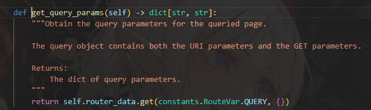
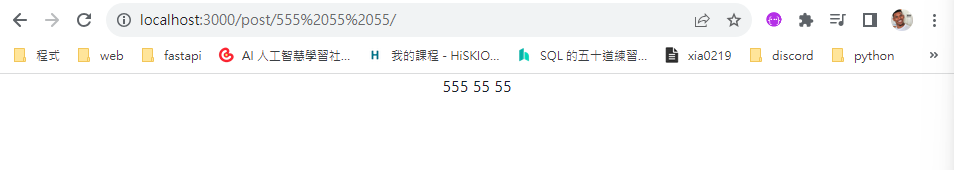
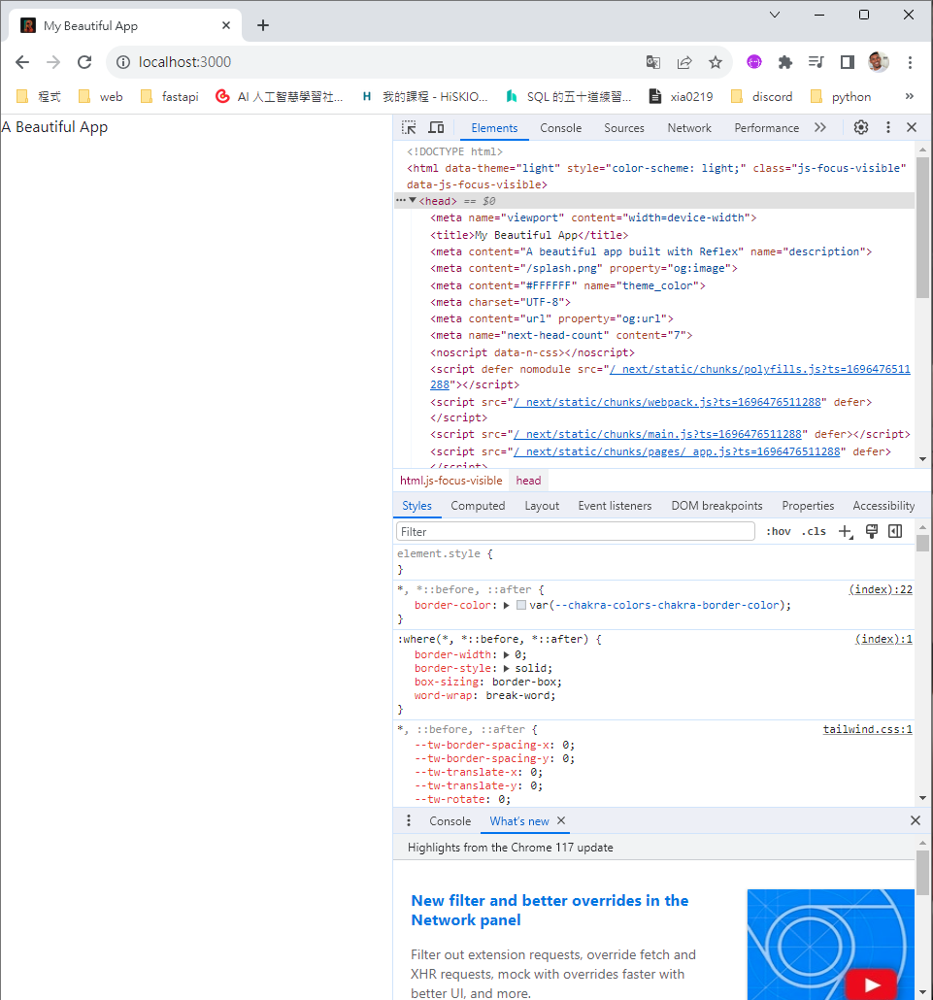
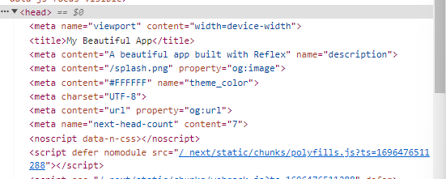

### Components

組件是reflex前端的建構模組，把UI分成獨立、可重複使用的部分。

reflex元件在背後包裝react元件，進而實現純 python體驗。

而組件由children 和 props 組成。

children是嵌套在組件內的文字或是reflex元件(作為位置參數傳遞)。
props影響組件的行為與外觀屬性(作為keyword參數傳遞)

而一般我們主要寫的是這樣。
```python
def index():
    return rx.vstack(
        rx.button_group(
            rx.button('1'),
            rx.button('2')
        ),
        rx.text('3'),
        style = {'color': "green.500"},
    )
```
`3`是我們要顯示的text，而`style`裡面的`color`可以修改文本內的外觀。

不過有些組件內有特定的用法，需要稍微注意一下，比如`circular_progress`裡的`circular_progress_label`，他就是回傳一個`value`給他顯示控制進度調的數值。

`color`在哪裡都可以用。

### 分頁

這裡不多說，先上程式碼。

```python
def index():
    return rx.text("Root Page")


def about():
    return rx.text("About Page")


app = rx.App()
app.add_page(index, route = "/")
app.add_page(about, route = "/about")
app.compile()
```

搜尋`http://localhost:3000/`與`http://localhost:3000/about/`即可看見結果。

一種叫做嵌套路由
```python
def page_page():
    return rx.text("我是在page/page裡喔！")


app = rx.App()
app.add_page(page_page, route="/page/page")
```

一種叫做動態路由
```python
# 這是官網的範例
class State(rx.State):
    @rx.var
    def post_id(self):
        return self.get_query_params().get("pid", "no pid")


def post():
    """A page that updates based on the route."""
    return rx.heading(State.post_id)


app = rx.App()
app.add_page(post, route="/post/[pid]")
app.compile()

```
`get_query_params`的解釋如下，可以透過這個函式找到先前輸入的值。


如果是多個的，官網上也有給予解釋
```python
def post():
    """A page that updates based on the route."""
    return rx.vstack(
        rx.text(State.post_id),
    )
```
輸入 `/post/555 55 55`就可以看到下圖。



一種是 Page Metadata
```python
def index():
    return rx.text("A Beautiful App")


def about():
    return rx.text("About Page")


meta = [
    {"name": "theme_color", "content": "#FFFFFF"},
    {"char_set": "UTF-8"},
    {"property": "og:url", "content": "url"},
]

app = rx.App()
app.add_page(
    index,
    title="My Beautiful App",
    description="A beautiful app built with Reflex",
    image="/splash.png",
    meta=meta,
)
app.add_page(about, title="About Page")
app.compile()
```

* 可以在瀏覽器中添加要顯示的標題
* 搜尋結果的描述
* 在社群媒體上分享頁面時顯示的預覽影像

在這裡可以看到(右鍵 + 檢查)


不過要找的地方在這裡

---
頁面載入
這是官網的範例，不過我沒有資料給他...這邊就隨手塞個csv或是json給他返回一個可以使用的檔都可以用。
```python
import reflex as rx
from typing import List, Dict

class State(rx.State):
    data: Dict[str, Any]

    def get_data(self):
        # Fetch data
        self.data = fetch_data()


def index():
    return rx.text("A Beautiful App")

app = rx.App()
app.add_page(index, on_load=State.get_data)
app.compile()
```

還有一種語法糖。
```python
class State(rx.State):
    pass

@rx.page(route="/", title="My Beautiful App")
def index():
    return rx.text("A Beautiful App")

@rx.page(route="/post", title="My Beautiful App post")
def index():
    return rx.text("post")

app = rx.App()
app.compile()
```

使用 `@rx.page`裝飾器來新增頁面，跟django和flask都差不多。

