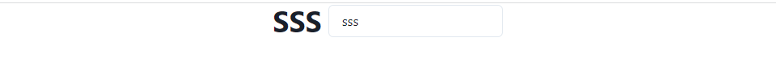

### Assets

圖表等靜態檔闇可以放在assets資料夾中，比如我們`reflex init`之後出現的`favicon.ico`。

我們可以使用`rx.image`來使用它。

```python
def index():
    return rx.image(
        src = '/favicon.ino',
        width = '5em'
    )
```

可如果是一般的靜態檔案
```python
with open('./assets/Your_file', 'r') as file:
    data = json.load(file)
```
上面是個`json`的範例，csv也是一樣的寫法。

### State

狀態可以允許我們創建一個響應使用者輸入的互動應用程式。

一開始我們建立一個繼承狀態的類別。

```python
import reflex as rx

class State(rx.State):
    pass
```

其實從前面看過來，我們有寫到幾點。
* 基礎變數，比如`1`, `2`，State在觸發事件的時候進行修改。
* 計算變數，根據其他變數自動更改的變數，裝飾器定義為`@rx.var`(這個貌似只用到一次？)
* 事件觸發，使用者交互，`props(on_click)`。
* 事件處理程序，更新狀態以回應事件的函數。

然後我們照著官網寫了`colors`的`list`。
```python
class State(rx.State):
    colors : List[str] = [
        'green.500',
        'blue.500',
        'red.500'
        'purple.500'
    ]
```
接著設置`index`。
```python
index: int = 0
```

跳轉至下個color的話，我們就用官網上的寫法。
```python
def next_color(self):
    self.index = (self.index + 1) % len(self.colors)

@rx.var
def color(self) -> str:
    return self.colors[self.color]
```
最後新增到頁面裡面
```python
def index():
    return rx.center(
        rx.heading(
            '點我',
            on_click = State.next_color,
            color = State.color,
            _hover = {"cursor": "pointer"},
        )
    )
```

最基本的變數是`color`和`index`，不過要注意的地方還是`@rx.var`，這裡指的是`color`這個變數需要這個裝飾器才可以運作，我的理解是確認這個color裡面的元素是否存在，如果有的話回傳這個value。

如果把`@rx.var`拿掉，則會出現`TypeError(f"Could not format prop: {prop} of type {type(prop)}") from e
TypeError: Could not format prop: {'color': EventHandler(fn=<function ExampleState.color at 0x7f9a0c4ab880>)} of type <class 'reflex.style.Style'>`這個錯誤。

`on_click`則是像前面所用的，直接連結到`State.next_color`這個事件去處理程序。

### Var

又跳回來這個部分了，甚麼時候要用到`@rx.var`？
emm...這個問題我還沒去想，不過一般來說我們會使用到這個裝飾器主要就那幾點，最重要的就是語法糖部分，它的本質也是一個函式，不過它是作為被裝飾的函式作為位置參數裝飾器透過某些操作後，返回一個函式引用。

我們這邊單舉一個輸入框，然後給他`recomptued`一下。

```python
class InputText(rx.State):
    text: str = '範例用'

    @rx.var
    def change_text(self) -> str:
        return self.text.upper()

def index():
    return rx.center(
        rx.hstack(
            rx.heading(InputText.change_text),
            rx.input(
                on_blur =InputText.set_text,
                placeholder = '在這裡輸入'
            )
        )
    )
```
結果如下圖。


明天繼續介紹Var的部分~