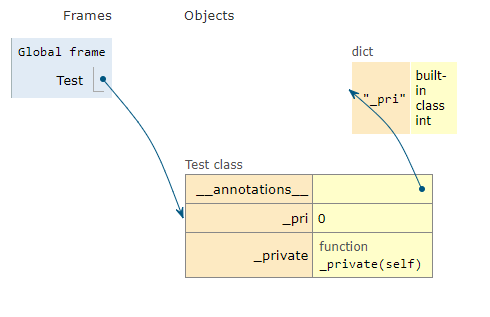

在官網有特別拉出一篇來說這個部分。

### Vars

變數是在應用程式裡隨著時間變化的任何欄位。

#### 基本變數

我們定義一個`class`來設定一個預設值，這邊建議給它一個類別。
```python
class VarState(rx.State):
    nums1: str = "100"
    nums2: str = '200'

def index():
    return rx.button_group(
        rx.button(
            VarState.nums1,
            color_scheme = 'twitter'
        ),
        rx.button(
            VarState.nums2,
            color_scheme = 'twitter'
        ),
    )
```

在這個範例裡面，`nums1`和`nums2`是基本變數，只可以在程式碼上進行修改。

變數必須是json可序列化的，可以想成就是一般的json檔進去程式裡面運行，主要用於前後端的聯繫，官網有說必須要是python類型、plotly圖形、pandas資料框...等。

不過基本上資料不外乎就是`txt`、`csv`、`json`...

#### 計算變數

計算變數是根據其他屬性計算的變數。它們透過裝飾器定義為 State 類別中的方法@rx.var。

```python
class InputState(rx.State):
    text: str = "Type something..."


def index():
    return rx.vstack(
        rx.text(InputState.text, color_scheme = "green"),
        rx.input(
            value = InputState.text,
            on_change = InputState.set_text,
        ),
    )
```

上面這段程式碼是我們之前有用過的，現在進行修改如下。
```python
class InputState(rx.State):
    text: str = "Type something..."

    @rx.var
    def upper_text(self) -> str:
        return self.text.upper()


def index():
    return rx.vstack(
        rx.text(InputState.text, color_scheme = "green"),
        rx.input(
            on_blur = InputState.set_text,
            placeholder = "從這裡輸入",
        ),
    )
```

這邊的`upper_text`是一個計算變量，接收回傳的`text`。

#### Var Operations

如果你一開始定義的是`int`，輸出卻要是`float`就會出錯。
因為前端是`js`，值的部分如果設定在`class`裡的話必須要遵守規則。

一般元件的基本操作如下。

```python
animals = ['cat', 'dog']

class VarState(rx.State):
    selected: str = '你是狗'

def index():
    return rx.center(
        rx.vstack(
            rx.heading(
                '你是甚麼？' + VarState.selected
            ),
            rx.select(
                animals,
                value = VarState.selected,
                on_change = VarState.set_selected
            )
        )
    )
```
示意圖如下


#### 後端變數

後端變數僅儲存在後端，不會傳送到客戶端。它們的優點是不需要 JSON 可序列化。這意味著您只能在事件處理程序中使用它們，而不能在前端元件中使用它們。(來自官網)

後端變數以`底線`為前綴。

```python
import numpy as np


class BackendState(rx.State):
    text: str = "大家好啊"
    _backend: np.ndarray = np.array([1, 2, 3])

    @rx.var
    def sum(self) -> int:
        return int(self._backend.sum())

    def click(self):
        # Add the next number to the array.
        self._backend = np.append(
            self._backend, [len(self._backend)]
        )


def index():
    return rx.center(
        rx.vstack(
            rx.text(f"Sum: {BackendState.sum}"),
            rx.button("Click Me", on_click = BackendState.click),
        )
    )
```
`Reflex 依賴類型註解來決定編譯過程中狀態變數的類型。`

#### 底線？

`_backend`的寫法代表內部使用，或是不建議使用，但還是可以取得這個值。

不過，在`import`中會定義成私人的而無法載入喔。

舉個例子

```python
class Test:
    _pri: int = 0
    def _private(self):
        print(_pri)
        print(private)
```



看 function 的部分就很清楚了。

如果還是覺得不夠清楚...那可以看看[這裡](https://lennychen.com/python-style-guide-pep8/)


#### 客戶儲存端。

您可以使用瀏覽器的本機儲存空間來保留會話之間的狀態。這允許將使用者首選項、身份驗證 cookie 和其他資訊儲存在客戶端上並從不同的瀏覽器標籤存取。

客戶端儲存變數的外觀和行為與普通變數類似，str只不過它根據值的儲存位置使用或進行註解。預設情況下，鍵名稱將與 var 名稱相同，但這可以被覆蓋。rx.Cookierx.LocalStorage

嘗試在下面的文字方塊中輸入一些值，然後在單獨的標籤中載入頁面，或檢查瀏覽器開發工具的儲存部分以查看瀏覽器中儲存的值。(這邊是google直接翻譯官網上的)

```python
class ClientStorageState(rx.State):
    my_cookie: rx.Cookie = ""
    my_local_storage: rx.LocalStorage = ""
    custom_cookie: rx.Cookie = rx.Cookie(
        name="CustomNamedCookie", max_age=3600
    )


def index():
    return rx.vstack(
        rx.hstack(
            rx.text("my_cookie"),
            rx.input(
                value=ClientStorageState.my_cookie,
                on_change=ClientStorageState.set_my_cookie,
            ),
        ),
        rx.hstack(
            rx.text("my_local_storage"),
            rx.input(
                value=ClientStorageState.my_local_storage,
                on_change=ClientStorageState.set_my_local_storage,
            ),
        ),
        rx.hstack(
            rx.text("custom_cookie"),
            rx.input(
                value=ClientStorageState.custom_cookie,
                on_change=ClientStorageState.set_custom_cookie,
            ),
        ),
    )
```

這邊我還沒去研究，不過應該都是大同小異，就是儲存你的身分是否存在資料庫，如果是的話就通行這樣