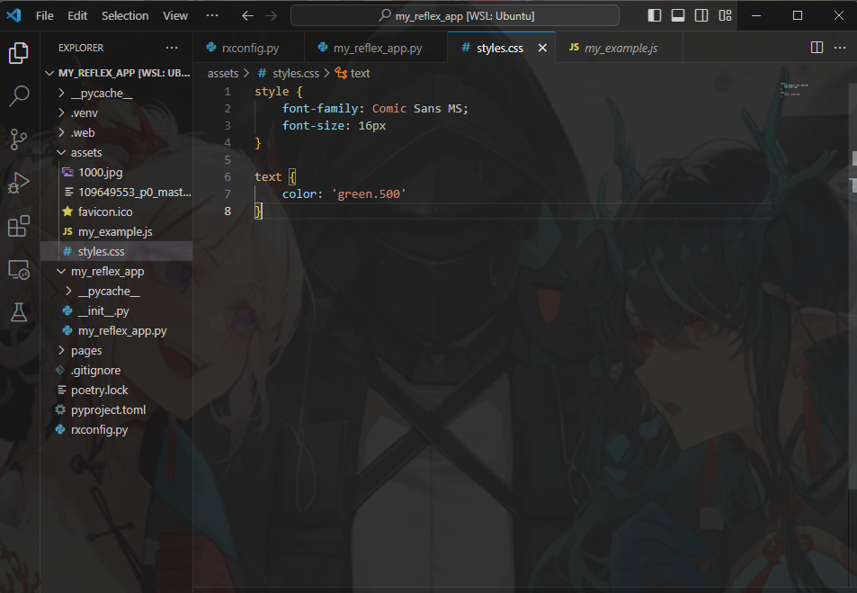
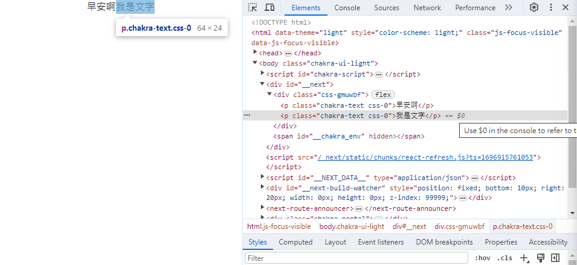
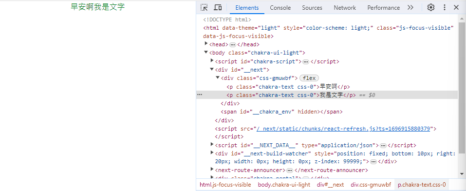

### 響應式

reflex應用程式反應迅速，在各項產品中看起來都不錯。
可以將值傳遞給任何樣式屬性，指定在不同螢幕尺寸的值。

```python
def index():
    return rx.text(
    "我會變色喔",
    color = ["orange", "red", "purple", "blue", "green"],
)
```
當我頁面是螢幕的一半時會是紫色，全螢幕時會是綠色。
可以自己試試看。

### 根據螢幕顯示不同的組件。
reflex有提供這種組件。
這邊就照官網的貼過來囉。
```python
def index():
    return rx.vstack(
        rx.desktop_only(
            rx.text("Desktop View"),
        ),
        rx.tablet_only(
            rx.text("Tablet View"),
        ),
        rx.mobile_only(
            rx.text("Mobile View"),
        ),
        rx.mobile_and_tablet(
            rx.text("Visible on Mobile and Tablet"),
        ),
        rx.tablet_and_desktop(
            rx.text("Visible on Desktop and Tablet"),
        ),
    )
```
用筆電或是家用電腦的應該是只看的到3行。

### 指定顯示斷點。
style屬性指定用於響應式元件的斷點display。
```python
def index():
    return rx.vstack(
        rx.text(
            "Hello World",
            color="green",
            display=["none", "none", "none", "none", "flex"],
        ),
        rx.text(
            "Hello World",
            color="blue",
            display=["none", "none", "none", "flex", "flex"],
        ),
        rx.text(
            "Hello World",
            color="red",
            display=["none", "none", "flex", "flex", "flex"],
        ),
        rx.text(
            "Hello World",
            color="orange",
            display=["none", "flex", "flex", "flex", "flex"],
        ),
        rx.text(
            "Hello World",
            color="yellow",
            display=["flex", "flex", "flex", "flex", "flex"],
        ),
    )
```
這邊一樣是官網的範例，如果要看完全部，記得將頁面放大到全螢幕！

### 自訂css

昨天有說過自訂，那現在我們來看一下css的部分。

#### URL
```python
app = rx.App(
    stylesheets=[
        "https://cdnjs.cloudflare.com/ajax/libs/animate.css/4.1.1/animate.min.css",
    ],
)
```

#### 本地端
直接拿官網的搞吧。
```python
app = rx.App(
    stylesheets=[
        "styles.css",  # This path is relative to assets/
    ],
)
```

放在資料夾如下


可我現在有點不明白的是如果我按照css的規範寫...好吧，我再改成
```css
/*
assets/styles.css 
*/
text {
    font-family: Comic Sans MS;
    font-size: 16px;
    color: green;
}
```
這樣結果依然不變，這時候打開F12...


這裡寫的是`p`，那就改成`p`吧。
```css
/*
assets/styles.css 
*/
p {
    font-family: Comic Sans MS;
    font-size: 16px;
    color: green;
}
```

總覺得繞了大彎，改成`p`就可以出現結果了。
在使用上來說個人會不太建議使用額外拉出的css，你寫在同個檔案看還比較方便，不過還是得看個人啦。

結果圖如下


### 字體

使用伺服器上託管的字體...
```css
/*
assets/YourCss.css // assets/fonts/YourCss.css
*/
@font-face {
    font-family: MyFont;
    src: url("MyFont.otf") format("opentype");
}

@font-face {
    font-family: MyFont;
    font-weight: bold;
    src: url("MyFont.otf") format("opentype");
}
```

這時候要在原始py檔內加上...
```python
app = rx.App(
    stylesheets = [
        "styles.css",
        "fonts/myfont.css",
    ],
)
```

### 主題

有提供深色模式的按鈕~
```python
def index():
    return rx.center(
        rx.button(
            rx.icon(tag = "moon"),
            on_click = rx.toggle_color_mode,
        )
    )
```

自訂的顏色不會被深色模式切換覆蓋！

------------------
剩下兩天，加油加油...只希望別碰上bug


