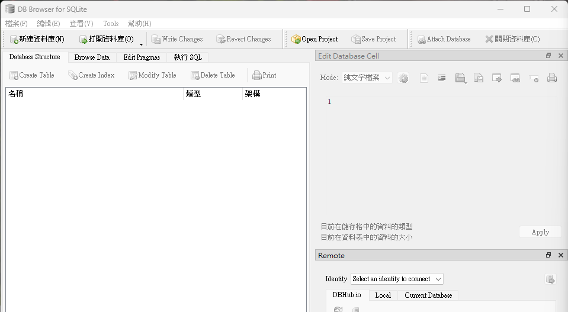
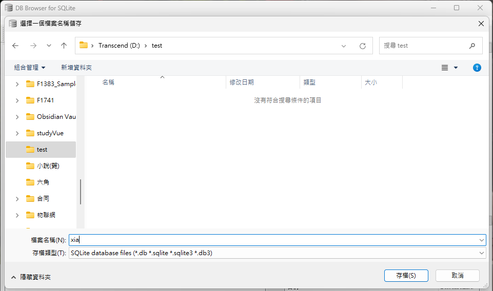
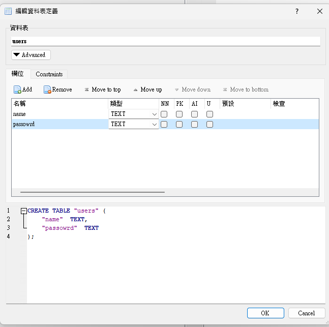
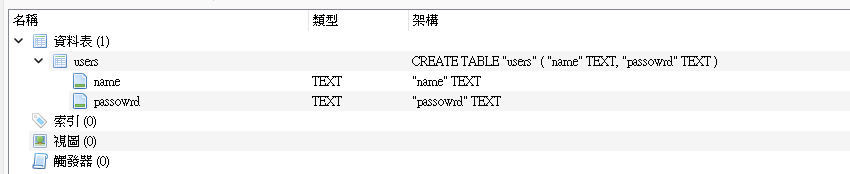
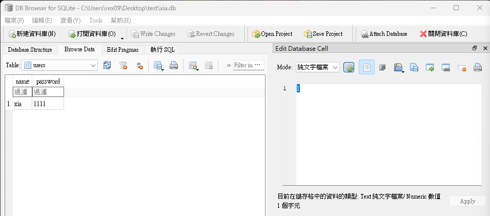
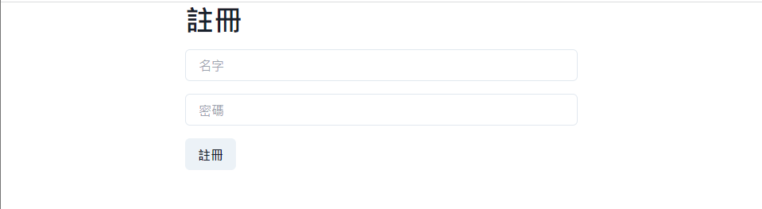
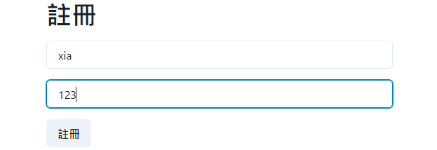
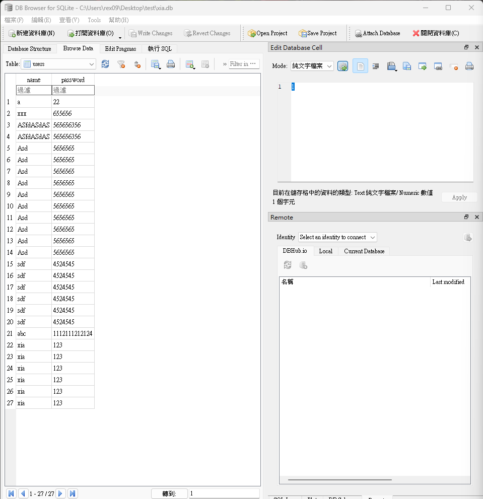

### DataBase

Reflex使用sqlmodel提供內建ORM包裝SQLAlchemy。
不過，再說這些之前，我們先來看`sqlite3`。
我自己也很久沒用到資料庫了，順便複習。

我們保險，直接從[DB Brower for SQLite](https://sqlitebrowser.org/dl/)去創建一個資料庫(因為reflex不給開，說是被鎖住，那我們另外抓個資料夾吧)

打開頁面長這樣。


創立資料庫


定義好後，按下ok


這裡會看到資料庫裡的鍵。


打開方才丟資料庫的那個資料夾，直接試著插入。
```python
import sqlite3
dbfile = "xia.db"
conn = sqlite3.connect(dbfile)
name = 'xia'
password = '1111'
sql_str = "insert into users(name, password) values('{}',{});".format(name, password)
conn.execute(sql_str)
conn.commit()
conn.close()
```
再運行以上程式碼後，重開一次`db`，會出現如下圖


第一階段任務完成，這時候我打算先把這個資料庫丟到`my_reflex_app`的專案裡。
然後更改設定檔如下(在 `rxconfig.py` 內)
```python
import reflex as rx

class MyreflexappConfig(rx.Config):
    pass

config = MyreflexappConfig(
    app_name="my_reflex_app",
    # env = rx.Env.DEV,
    db_url = "sqlite:///xia.db",
    tailwind = {
        "theme": {
            "extend": {},
        },
        "plugins": ["@tailwindcss/typography"],
    },
)
```

不過...大概率是不會弄到這邊的，我自己在弄得時候不熟悉，所以有特地拉出來寫。
一樣是在裡面新增一個`py`檔
```python
import sqlite3

conn = sqlite3.connect('xia.db')

cursor = conn.cursor()

cursor.execute('''
    CREATE TABLE IF NOT EXISTS users (
        name TEXT,
        password TEXT
    )
''')


sql_str1 = "insert into users(name, password) values('{}',{});".format('a', '22')
sql_str2 = "insert into users(name, password) values('{}',{});".format('xxx', '655656')

cursor.execute(sql_str1)
cursor.execute(sql_str2)

conn.commit()
conn.close()
```
這樣就可以確認當前資料夾裡面的`xia.db`是不是存在，裡面有沒有東西我們等結束再抓出來看。

好的，我們先開一個`state`的資料夾在`my_reflex_app`內部。
```
my_reflex_app
|
--state
|
--my_reflex_app.py
```
這樣，我們繼續在state資料夾內創建以下幾個檔案，並寫入
```python
# state/models.py
import reflex as rx

class User(rx.Model, table=True):
    name: str
    password: str
```
這邊用的是[sqlmodel](https://sqlmodel.tiangolo.com/)，詳情可以點開來閱讀。
建表必須要有繼承類`rx.Model`

```python
# state/state.py
import reflex as rx
from typing import Optional
from .models import User


class State(rx.State):

    user: Optional[User] = None
```
這邊抓到了`models.py`檔裡的`User`，確認無誤後，整理一下這個資料夾內部所有的`class`。

```python
# state/__init__.py
from .state import State
from . import models
```

好的，接下來我們回頭來看`my_reflex_app.py`，先處理class
```python
class RegisterState(State):
    # Register to xia.db

    name_field: str = ""
    password_field: str = ""

    def sign_up(self):
        dbfile = "xia.db"
        conn = sqlite3.connect(dbfile)
        name = self.name_field
        password = self.password_field
        sql_str = "insert into users(name, password) values('{}',{});".format(name, password)
        conn.execute(sql_str)
        conn.commit()
        conn.close()
        print('save')
```

再來是`index`。
```python

def index():
    return rx.vstack(
        rx.box(
            rx.heading("註冊", margin_bottom = "1rem"),
            rx.input(
                placeholder = "名字",
                margin_bottom = "1rem",
                on_change = RegisterState.set_name_field,
            ),
            rx.input(
                type_= " password",
                placeholder = "密碼",
                margin_bottom = "1rem",
                on_change = RegisterState.set_password_field,
            ),
            rx.button(
                "註冊", 
                on_click = RegisterState.sign_up,
            ),
        ),
    )
```
最後啟動它。
```python
app = rx.App(
    stylesheets = [
        # 之前寫的css沒刪喔
        "styles.css", 
    ],
)
app.add_page(index)
app.compile()
```
打開[首頁](http://localhost:3000)可以看見下圖。


隨意輸入如下圖


這邊同樣的，我們打開 `DB Brower for SQLite`。
點`Brower Data`就可以看見所有數據了。


目前就先這樣吧，最基本的就應該是這個了...