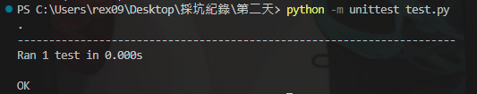
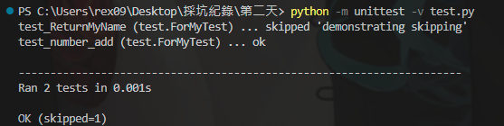

偶然找到一個名叫 `unittest `的套件，也就是單元測試用的，畢竟總不能一個一個給程式做測試。

`unittest`是原本就裝在 python 裡面的，所以無須另外下載。

現在直接先看一個小程式。
```python
import unittest

def PlusNumber(a, b):
        return a + b

# 測試類別，可以繼承並定義測試方法
class ForMyTest(unittest.TestCase):
    def test_ReturnMyName(self):
        name = "xia"
        self.assertEqual(list(name), ['x', 'i', 'a'])
        with self.assertRaises(TypeError):
            print("check")

    def test_number_add(self):
        answer = PlusNumber(1, 3)
        # 檢查返回值
        self.assertEqual(answer, 4)
        


if __name__ == '__main':
    unittest.main()
```

接著在底下輸入。
```cmd
python -m unittest test.py
```

會出現以下


這邊我沒有給他一個venv，沒有直接開一個虛擬環境，如果要開的話請輸入
```cmd
python3 -m venv [資料夾]
```

windows:
```cmd
[資料夾]\Scripts\activate
```

macOS/Linux：
```cmd
source myenv/bin/activate
```

再來回到 ```assert```這個單詞，這個字在pathon之中被譯為`斷言`，用來確認滿足是否符合表達式的條件，如無則直接觸發異常，不會執行到後面的程式碼。

上面的函式只是簡單地進行相加的步驟，所以應該可以很簡單的看出來沒有`TypeError`。

如果需要顯示命令列
```cmd
python -m unittest -h
```

更多的細節則使用
```cmd
python -m unittest -v [檔名]

...
// test_number_add (test.ForMyTest) ... ok
```

在 unittest 的命名規範裡，`test_` 開頭的測試會被自動運行。
如果要跳過測試呢？
```python
@unittest.skip("demonstrating skipping")
    def test_ReturnMyName(self):
    # ...
```
結果會呈現以下


還有跳過裝飾器的
```py
@unittest.skip(reason)
```
裡頭的api還真的蠻多的，到目前的3.11來說坑已經不算少了，後面如果需要的話可以點擊[這裡](https://docs.python.org/zh-tw/3/library/unittest.html)去做更多的查閱。

-----

不過更多的，大家應該都是使用 pytest 或是 vscode 內建的方式，我個人是使用後者，畢竟對我來說比較方便一點。

這裡先提一下 `pytest` ，在網路上有看到官網的引導，那就隨意的撰寫一個小程式給他運行吧。

- 安裝
```cmd
pip install pytest
```

接下來就隨便寫個幾行進去
```python
def test_passing():
    assert ['x', 'i', 'a'] == ['x', 'i', 'a']
```

如果要跳過測試
```python
@pytest.mark.skip(reason)
```
當然還有條件
```python
@pytest.mark.skipif(reason)
# @pytest.mark.skipif(Module.__version__ < '0.1.0', reason = '不支援')
```

查閱資料

- [vscode](https://code.visualstudio.com/docs/python/testing)
- [pytest](https://learning-pytest.readthedocs.io/zh/latest/index.html)
- [unittest](https://docs.python.org/zh-tw/3/library/unittest.html)