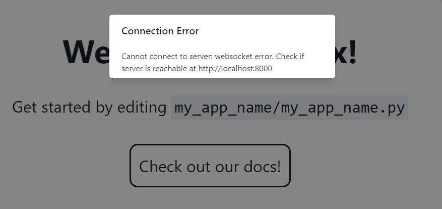
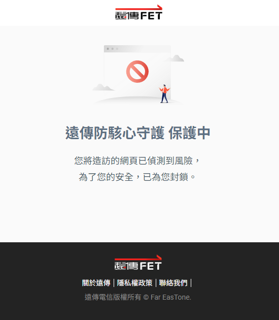
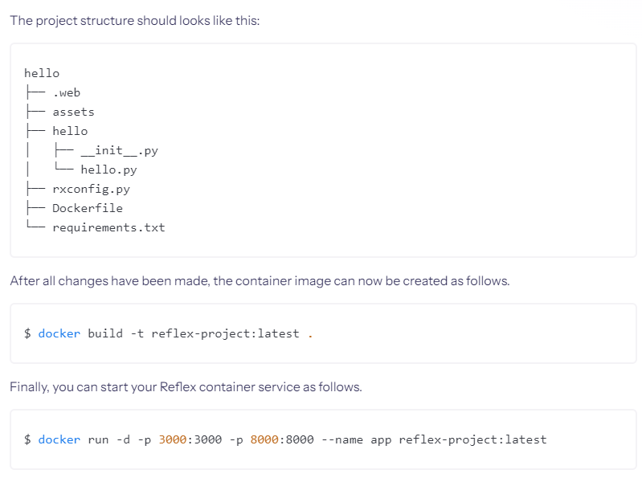

### 部署(？)

我們這次就用 [Vercel](https://vercel.com/) 進行部署吧。

#### why Vercel?

因為不想用github pages，況且 Vercel 還有和 github 連動。
對於免費仔來說，Vercle 絕對是夠用的，網站pr是單獨部署的，速度也快，有免費的serverless。

缺點就是...沒辦法用[`SQLite`](https://vercel.com/guides/is-sqlite-supported-in-vercel)，自己在測試的時候一直說找不到後端，這才找了下資料。

相對的，可以使用[Vercel Postgres](https://vercel.com/storage/postgres)，這是一個基於 PostgreSQL 建構的無伺服器、完全託管的關聯式資料庫，旨在與任何前端框架配合使用。

今天沒有要用到這麼高級的東西，我們只要可以部署，確定網站可以上線，那之後怎麼改都可以對吧？

不過....有點問題啊，我是自己有開一個 [repo](https://github.com/xiaLotus/sample_reflex_website/tree/main/my_app_name)

使用[YouTube](https://www.youtube.com/watch?v=5RiNm3Ucea0&list=PLDHA4931gtc7wHBDGQOYlmcpZm7qyici7&index=18&ab_channel=LineIndent)的這個教學，後端的部分一直卡在

於是我又找了個[nginx](https://www.youtube.com/watch?v=JzbxtiZQvDg&ab_channel=CodingJQ)的教學，很遺憾的是我這邊就算弄了開起來是...

於是，我打算先去看看別人怎麼處理這個，貌似都是用docker或是其他人自己的網域，目前問到的是可能要等到下個版本...

docker的部分我還沒研究，可就目前的時間來說有點來不及...怕是一研究，預計要做好的事情都不用做了，先這樣吧。

官網有給出[docker](https://reflex.dev/docs/hosting/self-hosting/)的寫法

我的vercel的話...[點我](https://xia-sample-reflex-website-r7xmltzwq-xias-projects.vercel.app/)

這個問題解決的話我會整理好並放在留言區，先這樣...吧。

### 感言

30天就這麼過了，感覺兩頭燒，不過慶幸的是至少每天還有幾個小時花在學習上面，否則真的感覺會腦子像是一坨拉庫...說到底，雖說有完賽，可就是差在最後一天，但相比於上一次參加鐵人賽又感覺好多了。

學得越多遇到的問題果然越多...還是從就近的問題開始處理吧，比如docker部署之類的，努力吧。

#### 感謝
感謝`discord`群組的大大們支援...十分感謝
還有感謝願意閱讀我的文章的讀者，願意花時間一起學習新的框架。
最後感謝我自己沒有忘記要連續發文30天，上次就是有是睡覺睡過頭...忘記發文...哈。

#### 期許
最後謝謝大家的閱讀，儘管最後差了點...(之後補齊)，希望未來可以更進步吧。
大概，就這樣...希望明年再見。
