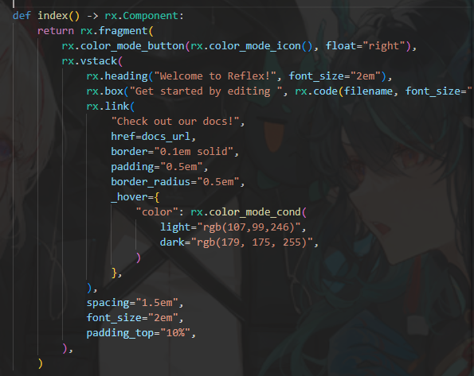
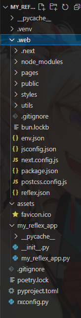
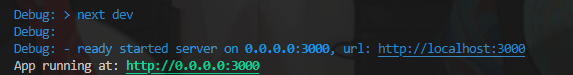
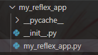
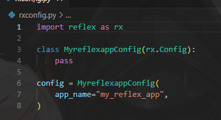
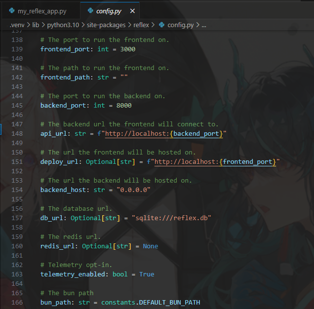
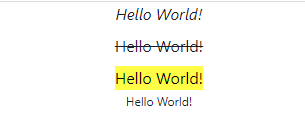
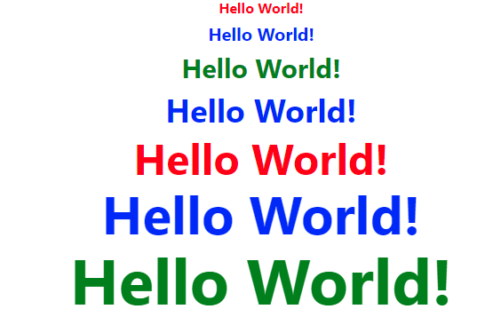
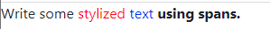
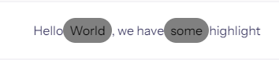

我又回來reflex啦！

因為之前叫做 Pynecone ，而在7月的時候改名...有些東西似乎不見了？
無所謂，繼續吧

- 環境
主要環境： vscode 
系統版本： wsl
瀏覽器： google
python -v： 3.10.6

這邊我是使用 wsl 做開發，不過說開發是開發，還是以給小白使用的介紹文。

- 先看看demo
這裡引入`import reflex as rx`，rx綁定狀態，即可開始撰寫，看return的部分就明白了，這裡的部分主要是對應到文字方面，以及某超連結`邊框圓角`，給予事件綁定。


最後則是使用以下程式碼啟動整個程式。
```python
# Add state and page to the app.
app = rx.App()
app.add_page(index)
app.compile()
```


- 目錄結構
reflex的前端為 nextjs，都放在 .wed的資料夾內，不過不需要動到該區域，直接理解成我們寫的 python 會直接轉乘 js，在掛載到 pages裡面，接著再由nextjs 啟動 js的部分。


這裡可以很明顯地看到不是使用`reflex run`，而是 `next dev`



- assets
存放靜態資源，圖片，字體，css 等。
一般來說是這樣呼叫
```python
reflex.image(src = "image.jpg")
```

而我們主要寫程式碼的地方還是在我們的demo裡面，如下圖可以看到`my_reflex_app/my_reflex_app.py`，從這裡直接修改(默認)。



- config
這裡會出現一個配置，不過新版的比舊版的少了許多，大概是要自己去寫的吧。



翻了翻 config.py，發現到都是設置好的，本地前端端口都是默認3000。


對於新手來說先別搞這麼複雜，先可以弄出一個基本的樣板再說。

- 組件
組件是建構 reflxe前端的必需品，而組件是可以拆開、重組的，如果有翻到 `config.py`的話，可以看到 props 具體的解釋是元組和字典。

- 文字
我們先把目前不需要的程式碼先給刪除。
```python
# ...
class State(rx.State):
    """The app state."""

    pass


def index() -> rx.Component:
    return 
# ... 
```
這邊我們先來查看一下文字的部分。
```python
# ...
return rx.vstack(
    rx.text("Hello World!", as_="i"),
    rx.text("Hello World!", as_="s"),
    rx.text("Hello World!", as_="mark"),
    rx.text("Hello World!", as_="sub"),
)
```
按照文檔，會顯示以下部分。


這裡的類別是 str，默認的標籤是<p>，觸發事件為`on_mount`與`on_unmount`，加載上去的時候是使用前者的事件處理程序，組件從頁面刪除的時候則使用後者，而不是在頁面刷新的時候調用。

- 標題

這個部分就比較簡單了，直接上程式碼。
```python
# ...
return rx.vstack(
        rx.heading("Hello World!", size="sm", color="red"),
        rx.heading("Hello World!", size="md", color="blue"),
        rx.heading("Hello World!", size="lg", color="green"),
        rx.heading("Hello World!", size="xl", color="blue"),
        rx.heading("Hello World!", size="2xl", color="red"),
        rx.heading("Hello World!", size="3xl", color="blue"),
        rx.heading("Hello World!", size="4xl", color="green"),
    )
```
css的部分可以直接編寫在後面。
默認標籤為<h2>，size的部分為4xl”| “3xl”| “2xl”| “xl”| “LG”| “MD”| “SM”| “xs”



- span

```python
# ...
return rx.box(
    "Write some ",
    rx.span("stylized ", color="red"),
    rx.span("text ", color="blue"),
    rx.span("using spans.", font_weight="bold"),
)
```
結果如下。


一般來說大家有寫過網頁都還挺熟的，就不贅述了。

- Markdown
```python
# ...
return rx.vstack(
    rx.markdown("# Hello World!"),
    rx.markdown("## Hello World!"),
    rx.markdown("### Hello World!"),
)

# rx.markdown(
#     """
# Support us at **[Reflex](https://pynecone.io)**.
# Format your `inline_code` easily.
# """
# )

# rx.markdown(r"$ \int_a^b x^2 dx $")
# 官網的程式碼可直接查找
```

這裡使用的是 dict 類別，不是和之前一樣是 str 囉。

- Highlight
```python
# ...
return rx.highlight(
    "Hello World, we have some highlight",
    query=["World", "some"],
    styles={
        "px": "2",
        "py": "1",
        "rounded": "full",
        "bg": "grey",
    },
)
# ...
```
結果如下。


query的部分使用的是list，凸顯文本。
styles的部分是 dict。

到這邊文字的部分基本上結束了，之後再把表格甚麼的慢慢寫上來吧。


[Day3 python 測試也是個大坑](https://ithelp.ithome.com.tw/articles/10318001)