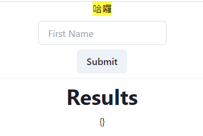
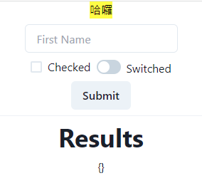
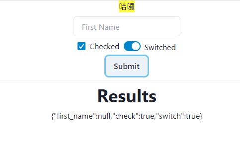
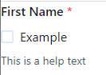
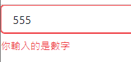

Forms 的部分比較多。

- Form
眾所皆知，表單都會有輸入的地方，或是可以控制點擊的地方，那在reflex裡面也是同樣，型態依舊是str。

這邊要注意的是，一個.py檔裡只能有一個`rx.State`，接下來也就是和 text那邊一樣，依樣畫葫蘆。

```python
# 參照官網
class FormState(rx.State):

    form_data: dict = {}
    # 這邊直接把型態定成 dict
    def handle_submit(self, form_data: dict):
        """Handle the form submit."""
        self.form_data = form_data
```

接下來就是輸入的格子。
```python
def index():
    return rx.vstack(
        rx.form(
            rx.vstack(
                rx.vstack(
                    rx.text("哈囉", as_ = 'mark')
                ),
                rx.input(
                    placeholder = "First Name",
                    id = "first_name",
                )
                rx.button("Submit", type_ = "submit"),
            ),
            # 輸入進去後轉成dict
            on_submit = FormState.handle_submit,
        ),
        # 分隔線
        rx.divider(),
        # heading 的文字
        rx.heading("Results"),
        # 這邊已經轉換成dict型態，不過要輸出前把他轉成str
        rx.text(FormState.form_data.to_string()),
    )
```
可以從圖中很明顯的看見我們的text與輸入的地方，還有我們的按鈕，分隔線下方則是回傳出來的str(文字)。


如果是依照官網
```python
# 這樣可以直接複製進去
                rx.hstack(
                     rx.checkbox("Checked", id="check"),
                     rx.switch("Switched", id="switch"),
                ),
                rx.button("Submit", type_="submit"),
            ),
            on_submit=FormState.handle_submit,
        ),
        rx.divider(),
        rx.heading("Results"),
        rx.text(FormState.form_data.to_string()),
```
check box 和 switch的格子就被我們顯示出來了。


當然你按下按鈕，回傳的時候一樣也會顯示


- Form control
先上程式碼的部分。
```python
# def ...
return rx.form_control(
    rx.form_label("First Name", html_for="email"),
    rx.checkbox("Example"),
    rx.form_helper_text("This is a help text"),
    is_required=True,
)
```
這邊的結果很明顯


這邊官網的案例是`len(self.name) <= 3`，我隨意改成是否為數字。
```python
class FormErrorState(rx.State):
    name: str

    @rx.var
    def is_error(self) -> bool:
        # return int(self.name) < 3
        print(self.name.isdigit())
        return self.name.isdigit()
    
def index():
    return rx.vstack(
        rx.form_control(
            rx.input(
                placeholder="name",
                on_blur=FormErrorState.set_name,
            ),
            rx.cond(
                FormErrorState.is_error,
                rx.form_error_message(
                    "你輸入的是數字"
                ),
                rx.form_helper_text("Enter name"),
            ),
            is_invalid=FormErrorState.is_error,
            is_required=True,
        )
    )
```
我們這邊是`is_error`去判斷，回傳是bool，所以我裡面回傳`true`的話，就會顯示紅色(對，就是你以為是錯的，結果是對的...)


`form_control`底下有個`rx.cond`
```python
rx.cond(
        FormErrorState.is_error,
        rx.form_error_message(
            "你輸入的是數字"
        ),
        rx.form_helper_text("Enter name"),
    ),
```

仔細去看，他的函式長這樣
```python
# in cond.py
def cond(condition: Any, c1: Any, c2: Any = None):
    """Create a conditional component or Prop.

    Args:
        condition: The cond to determine which component to render.
        c1: The component or prop to render if the cond_var is true.
        c2: The component or prop to render if the cond_var is false.

    Returns:
        The conditional component.

    Raises:
        ValueError: If the arguments are invalid.
    """
    # ...
```

可以知道前面是我們的判斷，再來是其他你想要寫的東西，上面是`rx.form_error_message`，回傳錯誤訊息，以及一個`rx.form_helper_text`。

