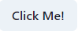
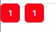
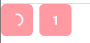
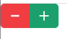
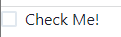

## button

這邊相較於前面就稍微簡單多了，直接上碼。
```python
# class ...(rx.State):
#     pass

def index():
    return rx.button("Click Me!")
```

最基本款的長這樣



如果是一組的呢？
```python
def index():
    return rx.button_group(
        rx.button(
            "1",
            bg = "red",
            color_scheme="white",
            size='sm'
            ),
        rx.button(
            "1",
            bg = "red",
            color_scheme="white",
            size='sm'
            ),    
    )
```
兩個相同的按鈕


當然也有其他樣式。
```python
def index():
    return rx.button_group(
        rx.button(
            "1",
            bg = "red",
            color_scheme="white",
            is_loading=True,
            ),
        rx.button(
            "1",
            bg = "red",
            color_scheme="white",
            is_disabled=True,
            ),    
    )
```


結合`icon`
```python
def index():
    return rx.button_group(
        rx.button(rx.icon(tag="minus"), color_scheme="red"),
        rx.button(rx.icon(tag="add"), color_scheme="green"),
        is_attached=True,
    )
```



在官網是寫個`button`，點擊加1減1，不過我覺得寫出來不是甚麼問題...
主要是你要知道這個函式裡可以放甚麼，像是`button`可以加上`on_click`，連接到外部的函式去運作。
```python
rx.button(
    "點我",
    bg = "#fef2f2",
    color = "#b91c1c",
    border_radius = "lg",
    on_click = classname.function,
),
```

## checkbox
點格子，這個大家應該都很熟悉，day4那篇(沒記錯的話)貌似有出現過。

```python
rx.checkbox("Check Me!")
```

這是最簡單的`checkbox`。

一般來說常見的是水平方向
```python
def index():
    return rx.hstack(
    rx.checkbox(
        "Example",
        color_scheme="green",
        size="lg",
        is_invalid=True,
    ),
    rx.checkbox(
        "Example",
        color_scheme="green",
        size="lg",
        is_disabled=True,
    ),
)
```
`hstack`這個詞是水平堆疊，`vstack`是垂直堆疊，稍微注意一下。


`checkbox`掛勾狀態在`on_change`這個prop裡。

```python
# 照官網
class CheckboxState(rx.State):
    checked: bool = False

    def toggle(self):
        self.checked = not self.checked


def index():
    return rx.hstack(
        rx.cond(
            CheckboxState.checked,
            rx.text("Checked", color="green"),
            rx.text("Unchecked", color="red"),
        ),
        rx.checkbox(
            "Example",
            on_change=CheckboxState.set_checked,
        ),
        rx.box(
            "Example",
            on_blur=CheckboxState.toggle,
        ),
    )
```

建議是直接照貼過去，自己運行一次，相信會比較清楚。
我們可以看到`on_change`這個hook，如果不想記得太多就直接記`我點他要給他進入另一個地方給他執行，隨後展示結果到頁面上，這就需要State與class以及class裡的運作`，感覺有些拗口啊...

~~多寫幾次總會明白的~~

這麼說方向不會錯就是了。

- Checkbox Group

和 `button_group`一樣，button有的checkbox沒道理沒有。
```python
rx.checkbox_group(
    rx.checkbox("Example", color_scheme="green"),
    rx.checkbox("Example", color_scheme="blue"),
    rx.checkbox("Example", color_scheme="yellow"),
    rx.checkbox("Example", color_scheme="orange"),
    rx.checkbox("Example", color_scheme="red"),
    space="1em",
)
```

這邊就直接貼程式碼了，結果就是橫向的一排checkbox。