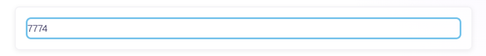
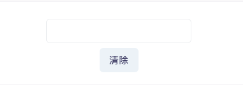
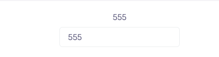
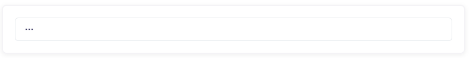

### editable

可編輯的區塊，當我們滑鼠移過去並點擊的時候，會轉換成可輸入的欄位。
```python
class EditableState(rx.State):
    example_input: str
    example_textarea: str
    example_state: str

    def set_uppertext(self, example_state: str):
        self.example_state = example_state.upper()


def index():
    return rx.editable(
        rx.editable_preview(),
        rx.editable_input(),
        placeholder="An input example...",
        on_submit=EditableState.set_uppertext,
        width="100%",
    )
```
不過有個小問題是，要點到字或是句尾才會出現可輸入的框框。


裡面有`on_edit`、`on_cancel`等，前者顧名思義是在編輯的時候呼叫，後者則是使用者點擊取消按鈕時會呼叫它。

### input

不多說，直接上碼。
```python
class InputState(rx.State):
    text: str = "Type something..."


def index():
    return rx.vstack(
        rx.text(InputState.text, color_scheme="green"),
        rx.input(
            value=InputState.text,
            on_change=InputState.set_text,
        ),
    )
```
這背後的元件是利用`debounced input`，當我們在使用的同時，系統會等待一小段的時間，如果沒有後續的輸入，這才會觸發相應的事件與操作，可以避免掉性能問題或是不必要的計算。

可以提高整個程式的效率與性能。

clear的部分是加個button就可以解決
```python
class ClearInputState(rx.State):
    text: str

    def clear_text(self):
        self.text = ""


def index():
    return rx.vstack(
        rx.text(ClearInputState.text),
        rx.input(
            on_change=ClearInputState.set_text,
            value=ClearInputState.text,
        ),
        rx.button(
            "Clear", on_click=ClearInputState.clear_text
        ),
    )
```
按下clear可以清除當前輸入



再來是`on_blur`事件，它會在使用者輸入完成並離開輸入框十才變更狀態。
```python
class InputBlurState(rx.State):
    text: str = "Type something..."

    def set_text(self, text: str):
        self.text = text.upper()


def index():
    return rx.vstack(
        rx.text(InputBlurState.text),
        rx.input(
            placeholder="Type something...",
            on_blur=InputBlurState.set_text,
        ),
    )
```
輸入555，並點擊旁邊的白色區塊。


變更`prop`來更改輸入類型，官網上寫的是日期選擇與輸入密碼。
```python
rx.vstack(
    # 密碼
    rx.input(type_="password"),
    # 日期
    rx.input(type_="date"),
)
```

同時也提供了`rx.password()`元件作為輸入密碼的簡寫。




提交表單的話，前面幾章好像就有提過類似的，這邊就快速的撰寫一個吧。
```python
"""Welcome to Reflex! This file outlines the steps to create a basic app."""
from rxconfig import config

import reflex as rx

class FormInputExample(rx.State):
    data : dict = {}

    def check_data_submit(self, data: dict):
        self.data = data
        
        return [
            rx.set_value(field_id, '')
            for field_id in data
        ]


def index():
    return rx.vstack(
        rx.form(
            rx.hstack(
                rx.input(
                    placeholder = "帳號",
                    id = "account",
                ),
                rx.input(
                    placeholder = "密碼",
                    id = 'password',
                ),
                rx.button('提交', type_ = 'submit'),
            ),
            on_submit = FormInputExample.check_data_submit,
        ),
        rx.divider(),
        rx.heading('呈現結果'),
        rx.text(FormInputExample.data.to_string()),
    )

# Add state and page to the app.
app = rx.App()
app.add_page(index)
app.compile()
```

這邊值得一提的是`field_id`這個地方，我們可以看到上面的data是一個字典，`field_id`在這邊是一個變數，我們使用`for`去遍歷`data`當中的所有鍵(ID)，`set_value`後方的空白是，當我們送出表單，便直接清空欄位。


