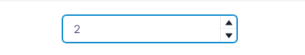
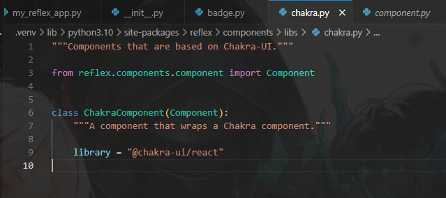
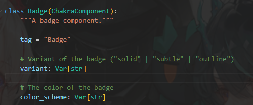

### NumberInput

這個部分應該簡單明瞭，就直接上碼了。
```python
class NumberInputState(rx.State):
    number: int


def index():
    return rx.number_input(
        on_change=NumberInputState.set_number,
    )
```



### PinInput
引腳輸入，可以自己定義格子(輸入框框)
```python
class PinInputState(rx.State):
    pin: str


def index():
    return rx.vstack(
        rx.heading(PinInputState.pin),
        rx.box(
            rx.pin_input(
                length=4,
                on_change=PinInputState.set_pin,
                mask=True,
            ),
        ),
    )
```

不過一般來說基本上不會對格子做甚麼奇妙的設計，大抵上就是`bg`、`color`、`shadow`等...css的部分可以直接寫在`pin_input`內。

```python
rx.pin_input_field(border_radius="md"),
```

### RadioGroup
有寫過app的應該對這個都很熟悉，也直接上碼吧。
```python
# 這是官網的程式碼
from typing import List

options: List[str] = ["Option 1", "Option 2", "Option 3"]


class RadioState(rx.State):
    text: str = "No Selection"


def index():
    return rx.vstack(
        rx.badge(RadioState.text, color_scheme="green"),
        rx.radio_group(
            options,
            on_change=RadioState.set_text,
        ),
    )
```

這個部分也很簡單明瞭，`rx.badge`這個東西有點奇妙，找到所謂的元件後會是`react.ui`，也就看一看就可以了。


至於`rx.badge`的參數，基本上是兩個，一個是`var`，另一個是`color`。


設定預設值的時候請用`default_value`。
```python
def index():
    return rx.vstack(
        rx.radio_group(
            options,
            default_value="Option 2",
            default_checked=True,
        ),
    )
```

可以使用 `spacing`參數來設定單選按鈕的間距。
```python
    return rx.radio_group(
        rx.radio_group(
            rx.hstack(
                # ...
                spacing = "2em",
            ),
        ),
    )
```


[Day8-1 Input與RadioGroup](https://ithelp.ithome.com.tw/articles/10322285)
[Day8-2 Select與Slider](https://ithelp.ithome.com.tw/articles/10323277)