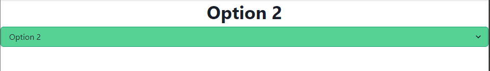
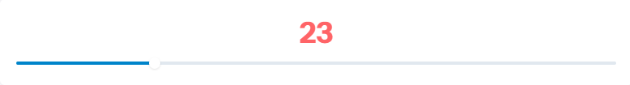

### Select

跳過 RangeSlider 的部分，`select`比較常用到。

先定義選項。
```python
options: List[str] = ["Option 1", "Option 2", "Option 3"]


class SelectState(rx.State):
    option: str = "No selection yet."

def index():
    return rx.vstack(
        rx.heading(SelectState.option),
        rx.select(
            options,
            placeholder="Select an example.",
            on_change=SelectState.set_option,
            color_schemes="twitter",
        ),
    )
```
這時候網頁應該會出現一個可供選擇的下拉式選單，不過官網有給出一個比較漂亮點的選單樣式。
```python
def index():
    return rx.vstack(
        rx.heading(SelectState.option),
        rx.select(
            options,
            placeholder="Select an example.",
            on_change=SelectState.set_option,
            bg="#68D391",
            border_color="#38A169",
        ),
    )
```
跑出來長這樣


### Slider
不多說，這邊直接上碼。
```python
class SliderCombo(rx.State):
    value: int = 50
    color: str = "black"

    def set_start(self):
        self.color = "#68D391"

    def set_end(self):
        self.color = "#F56565"


def index():
    return rx.vstack(
        rx.heading(
            SliderCombo.value, color=SliderCombo.color
        ),
        rx.slider(
            on_change_start=SliderCombo.set_start,
            on_change=SliderCombo.set_value,
            on_change_end=SliderCombo.set_end,
        ),
        width="100%",
    )
```
官網上的截圖，途中拉動中間圓圈會使數字變換顏色。


如果你想要在滑動的時候看見狀態更改，就使用`on_change`，如果是在挪動滑桿結束後才要呈現結果，則使用`on_change_end`，裡面有許多參考或是種類可以做使用。