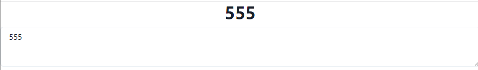
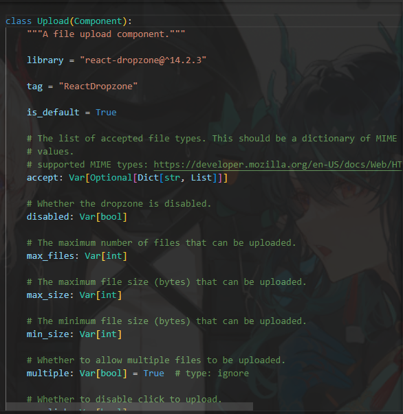
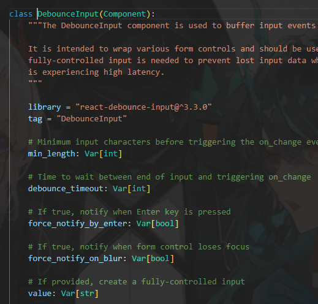

### switch

`switch`元件大多當作`checkbox`的代替品。

```python
class SwitchState(rx.State):
    checked: bool = False
    is_checked: bool = "Switch off!"

    def change_check(self, checked: bool):
        self.checked = checked
        if self.checked:
            self.is_checked = "Switch on!"
        else:
            self.is_checked = "Switch off!"


def index():
    return rx.vstack(
        rx.heading(SwitchState.is_checked),
        rx.switch(
            is_checked=SwitchState.checked,
            on_change=SwitchState.change_check,
            # color_scheme = 'color'
        ),
    )
```
這邊寫法就比較平常了，況且`switch`同時也具有`color_scheme`的參數來變更顏色，預設是藍色。

裡面同時也有其他參數，比如`is_disabled`、`spacing`、`placeholder`等，而上方程式碼也有最基礎的`is_checked`與`on_changed`。

圖長這樣。


### TextArea

文本輸入區塊，大框框。

```python
class TextareaState(rx.State):
    text: str = "Hello World!"


def index():
    return rx.vstack(
        rx.heading(TextareaState.text),
        rx.text_area(
            value=TextareaState.text,
            on_change=TextareaState.set_text,
        ),
    )
```

依照官網，結果如下。


可以使用`on_blur`去處理程式在使用者點擊完後離開時更新狀態，和`input`元件類似，而`TextArea`也是用抖動輸入來實踐的，這點要稍微注意一下需求。

### Upload

上傳部分，也有相應的元件。
```python
def index():
    return rx.upload(
        rx.text(
            "Drag and drop files here or click to select files"
        ),
        border="1px dotted rgb(107,99,246)",
        padding="5em",
    )
```
不過在運行的時候需要另外下載其他檔案(會自動下載)，稍微等一下即可。


檢閱上圖，我們可以看見許多參數，包括最大上傳數等資訊。

不過主要來是要講這個`accept: Var[Optional[Dict[str, List]]]`，主要來說上傳圖片通常是`.jpg`或是`.png`，如果你要限制上傳檔案的話就要記得去寫這個部分。

```python
accept = {
    'img/png': [".png"],
    'img/jpeg': ['.jpg', '.jpeg'],
    # ...
}
```
當然一般的css也可以使用在上面，`border`、`padding`等...

可參閱[FastAPI 請求上傳文件](https://fastapi.tiangolo.com/tutorial/request-files/)


### DebounceInput
reflex是一個以後端為中心的框架，`可能會在使用者提供交互、互動式回饋的時候對城市產生負面效能影響`。

`rx.debounce_input`這個元件可以在接收使用者輸入時保持回應，在延遲、模糊或是在按下確認鍵時才將數值傳送給後端。

大多數接收`prop`和事件處理的元件都可以使用。

```python
class DebounceCheckboxState(rx.State):
    checked: bool = False


def index():
    return rx.hstack(
        rx.cond(
            DebounceCheckboxState.checked,
            rx.text("Checked", color="green"),
            rx.text("Unchecked", color="red"),
        ),
        rx.debounce_input(
            rx.checkbox(
                on_change=DebounceCheckboxState.set_checked,
            ),
            debounce_timeout=1000,
        ),
    )
```

上方程式碼的狀況是，點擊後1秒才轉換。

主要就幾個參數`min_length`(觸發`on_change`前需要的最少字元數)、`force_notify_by_enter`按下enter才開始運作、`value`控制輸入等...


[Day9 switch、DebounceInput](https://ithelp.ithome.com.tw/articles/10324068)